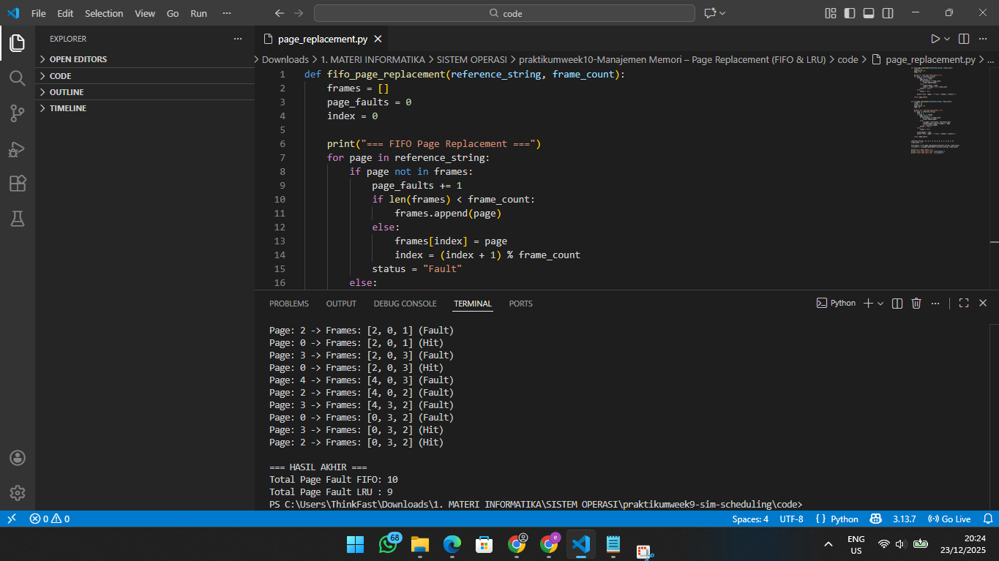

# Laporan Praktikum Minggu X
Topik: Manajemen Memori – Page Replacement (FIFO & LRU)

---

## Identitas
- **Nama**  : Ervita Dwi Riyanti
- **NIM**   : 250202977
- **Kelas** : 1IKRA


---

## Tujuan
Tujuan dari praktikum ini adalah:

1. Mengimplementasikan algoritma page replacement FIFO dalam program.
2. Mengimplementasikan algoritma page replacement LRU dalam program.
3. Menjalankan simulasi page replacement dengan dataset tertentu.
4. Membandingkan performa FIFO dan LRU berdasarkan jumlah page fault.
5. Menyajikan hasil simulasi dalam laporan yang sistematis.

---

## Dasar Teori
1. Manajemen memori virtual memungkinkan sistem operasi menggunakan sebagian penyimpanan sekunder sebagai perpanjangan memori utama melalui mekanisme paging.

2. Page fault terjadi ketika halaman yang dibutuhkan proses tidak berada di memori utama, sehingga sistem harus memuatnya dari penyimpanan sekunder.

3. Page replacement diperlukan saat memori penuh, untuk menentukan halaman mana yang harus diganti agar halaman baru dapat dimuat.

4. Algoritma FIFO mengganti halaman berdasarkan urutan kedatangan tanpa mempertimbangkan pola penggunaan, sehingga dapat menghasilkan page fault yang tinggi.

5. Algoritma LRU mengganti halaman yang paling lama tidak digunakan dengan memanfaatkan riwayat akses, sehingga umumnya lebih efisien dalam mengurangi page fault.
---

## Langkah Pengerjaan
1. **Menyiapkan Dataset**

   Gunakan *reference string* berikut sebagai contoh:
   ```
   7, 0, 1, 2, 0, 3, 0, 4, 2, 3, 0, 3, 2
   ```
   Jumlah frame memori: **3 frame**.

2. **Implementasi FIFO**

   - Simulasikan penggantian halaman menggunakan algoritma FIFO.
   - Catat setiap *page hit* dan *page fault*.
   - Hitung total *page fault*.

3. **Implementasi LRU**

   - Simulasikan penggantian halaman menggunakan algoritma LRU.
   - Catat setiap *page hit* dan *page fault*.
   - Hitung total *page fault*.

4. **Eksekusi & Validasi**

   - Jalankan program untuk FIFO dan LRU.
   - Pastikan hasil simulasi logis dan konsisten.
   - Simpan screenshot hasil eksekusi.

5. **Analisis Perbandingan**

   Buat tabel perbandingan seperti berikut:

   | Algoritma | Jumlah Page Fault | Keterangan |
   |:--|:--:|:--|
   | FIFO | ... | ... |
   | LRU | ... | ... |


   - Jelaskan mengapa jumlah *page fault* bisa berbeda.
   - Analisis algoritma mana yang lebih efisien dan alasannya.

6. **Commit & Push**

   ```bash
   git add .
   git commit -m "Minggu 10 - Page Replacement FIFO & LRU"
   git push origin main
   ```

---
## Hasil Eksekusi
Sertakan screenshot hasil percobaan atau diagram:


---


## Kode / Perintah
Kode yang digunakan
```bash
def fifo_page_replacement(reference_string, frame_count):
    frames = []
    page_faults = 0
    index = 0

    print("=== FIFO Page Replacement ===")
    for page in reference_string:
        if page not in frames:
            page_faults += 1
            if len(frames) < frame_count:
                frames.append(page)
            else:
                frames[index] = page
                index = (index + 1) % frame_count
            status = "Fault"
        else:
            status = "Hit"

        print(f"Page: {page} -> Frames: {frames} ({status})")

    return page_faults


def lru_page_replacement(reference_string, frame_count):
    frames = []
    recent = {}
    page_faults = 0
    time = 0

    print("\n=== LRU Page Replacement ===")
    for page in reference_string:
        time += 1
        if page not in frames:
            page_faults += 1
            if len(frames) < frame_count:
                frames.append(page)
            else:
                lru_page = min(recent, key=recent.get)
                frames[frames.index(lru_page)] = page
                del recent[lru_page]
            status = "Fault"
        else:
            status = "Hit"

        recent[page] = time
        print(f"Page: {page} -> Frames: {frames} ({status})")

    return page_faults


reference_string = [7, 0, 1, 2, 0, 3, 0, 4, 2, 3, 0, 3, 2]
frame_count = 3

fifo_faults = fifo_page_replacement(reference_string, frame_count)
lru_faults = lru_page_replacement(reference_string, frame_count)

print("\n=== HASIL AKHIR ===")
print(f"Total Page Fault FIFO: {fifo_faults}")
print(f"Total Page Fault LRU : {lru_faults}")

```

## Hasil Implementasi FIFO
Hasil berikut menunjukkan proses simulasi page replacement menggunakan algoritma FIFO dengan jumlah frame sebanyak 3.

```
=== FIFO Page Replacement ===
Page: 7 -> Frames: [7] (Fault)
Page: 0 -> Frames: [7, 0] (Fault)
Page: 1 -> Frames: [7, 0, 1] (Fault)
Page: 2 -> Frames: [2, 0, 1] (Fault)
Page: 0 -> Frames: [2, 0, 1] (Hit)
Page: 3 -> Frames: [2, 3, 1] (Fault)
Page: 0 -> Frames: [2, 3, 0] (Fault)
Page: 4 -> Frames: [4, 3, 0] (Fault)
Page: 2 -> Frames: [4, 2, 0] (Fault)
Page: 3 -> Frames: [4, 2, 3] (Fault)
Page: 0 -> Frames: [0, 2, 3] (Fault)
Page: 3 -> Frames: [0, 2, 3] (Hit)
Page: 2 -> Frames: [0, 2, 3] (Hit)

=== HASIL AKHIR ===
Total Page Fault FIFO: 10
```
FIFO mengganti halaman berdasarkan urutan masuk ke memori.

## Hasil Implementasi LRU
Berikut merupakan hasil simulasi page replacement menggunakan algoritma LRU dengan jumlah frame yang sama.
```
=== LRU Page Replacement ===
Page: 7 -> Frames: [7] (Fault)
Page: 0 -> Frames: [7, 0] (Fault)
Page: 1 -> Frames: [7, 0, 1] (Fault)
Page: 2 -> Frames: [2, 0, 1] (Fault)
Page: 0 -> Frames: [2, 0, 1] (Hit)
Page: 3 -> Frames: [2, 0, 3] (Fault)
Page: 0 -> Frames: [2, 0, 3] (Hit)
Page: 4 -> Frames: [4, 0, 3] (Fault)
Page: 2 -> Frames: [4, 0, 2] (Fault)
Page: 3 -> Frames: [4, 3, 2] (Fault)
Page: 0 -> Frames: [0, 3, 2] (Fault)
Page: 3 -> Frames: [0, 3, 2] (Hit)
Page: 2 -> Frames: [0, 3, 2] (Hit)

=== HASIL AKHIR ===
Total Page Fault LRU : 9
```
LRU mengganti halaman yang paling lama tidak digunakan.

---

## Analisis

| Algoritma | Jumlah Page Fault | Keterangan                                         |
| --------- | ----------------- | -------------------------------------------------- |
| FIFO      | 10                | Mengganti halaman berdasarkan urutan masuk         |
| LRU       | 9                 | Mengganti halaman yang paling lama tidak digunakan |

Perbedaan jumlah page fault terjadi karena strategi penggantian halaman yang digunakan oleh masing-masing algoritma.

FIFO tidak mempertimbangkan apakah halaman masih sering digunakan atau tidak. Halaman yang masuk lebih awal akan diganti terlebih dahulu, meskipun masih dibutuhkan.

LRU mempertimbangkan pola penggunaan halaman dengan mengganti halaman yang paling lama tidak diakses, sehingga lebih adaptif terhadap perilaku program.

Berdasarkan hasil simulasi, LRU lebih efisien dibanding FIFO karena menghasilkan jumlah page fault yang lebih sedikit.

---

## Kesimpulan
Algoritma FIFO memiliki tingkat kompleksitas yang lebih rendah sehingga lebih mudah diimplementasikan, namun kurang efisien karena tidak mempertimbangkan pola penggunaan halaman. Sebaliknya, algoritma LRU lebih kompleks karena memerlukan pencatatan riwayat akses halaman, tetapi mampu menghasilkan performa yang lebih baik. Berdasarkan hasil simulasi pada dataset uji, LRU menghasilkan jumlah page fault yang lebih sedikit dibanding FIFO. Oleh karena itu, pemilihan algoritma page replacement sangat berpengaruh terhadap kinerja sistem secara keseluruhan.

---

## Quiz
1. Apa perbedaan utama FIFO dan LRU?
   **Jawaban:**
   FIFO mengganti halaman berdasarkan urutan kedatangan paling awal di memori, sedangkan LRU mengganti halaman yang paling lama tidak digunakan berdasarkan riwayat akses.
2. Mengapa FIFO dapat menghasilkan Belady’s Anomaly?
   **Jawaban:**
   Karena FIFO tidak mempertimbangkan frekuensi atau pola penggunaan halaman, sehingga penambahan jumlah frame justru dapat meningkatkan jumlah page fault (Belady’s Anomaly).
3. Mengapa LRU umumnya menghasilkan performa lebih baik dibanding FIFO?
   **Jawaban:**
   LRU mempertimbangkan pola akses halaman dengan mempertahankan halaman yang sering digunakan, sehingga lebih adaptif terhadap perilaku program dan menghasilkan page fault yang lebih sedikit.

---

## Refleksi Diri
Tuliskan secara singkat:
- Apa bagian yang paling menantang minggu ini?  
- Bagaimana cara Anda mengatasinya?  

---

**Credit:**  
_Template laporan praktikum Sistem Operasi (SO-202501) – Universitas Putra Bangsa_
