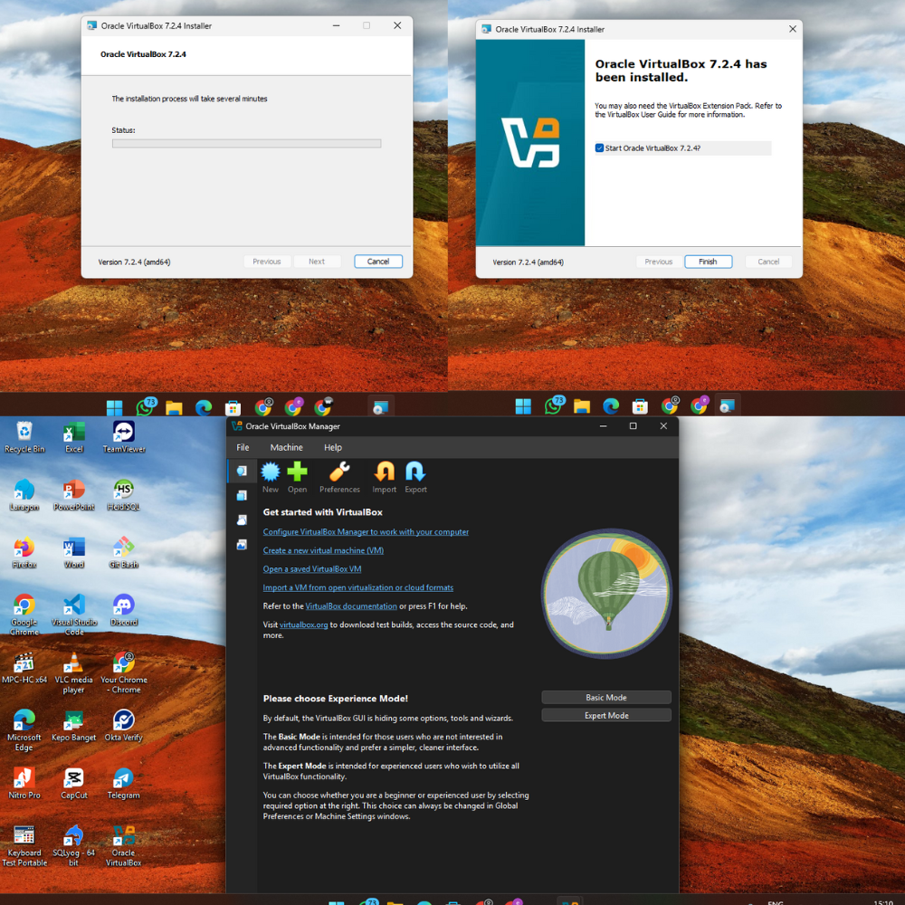
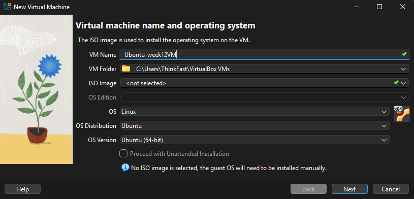
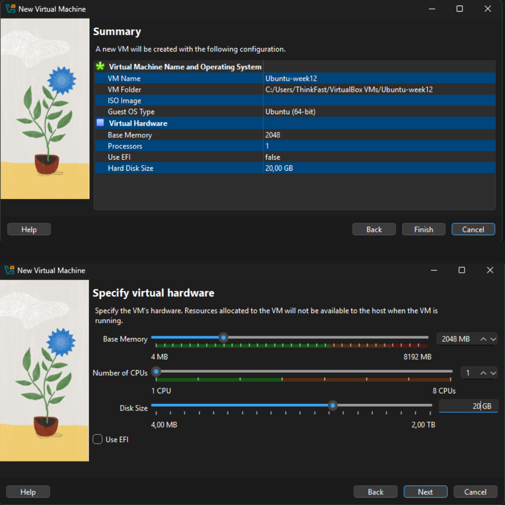

# Laporan Praktikum Minggu XII
Topik: Virtualisasi Menggunakan Virtual Machine  

---

## Identitas
- **Nama**  : Ervita Dwi Riyanti
- **NIM**   : 250202977
- **Kelas** : 1IKRA

---

## Tujuan
Setelah menyelesaikan tugas ini, mahasiswa mampu:
1. Menginstal perangkat lunak virtualisasi (VirtualBox/VMware).  
2. Membuat dan menjalankan sistem operasi guest di dalam VM.  
3. Mengatur konfigurasi resource VM (CPU, RAM, storage).  
4. Menjelaskan mekanisme proteksi OS melalui virtualisasi.  
5. Menyusun laporan praktikum instalasi dan konfigurasi VM secara sistematis.

---

## Dasar Teori
1. Virtualisasi Sistem Operasi
Virtualisasi memungkinkan satu perangkat keras fisik menjalankan beberapa sistem operasi secara bersamaan melalui mesin virtual (Virtual Machine).

2. Host OS dan Guest OS
Host OS adalah sistem operasi utama yang berjalan langsung pada perangkat keras, sedangkan guest OS berjalan di lingkungan virtual yang terisolasi.

3. Hypervisor
Hypervisor merupakan perangkat lunak yang mengelola dan membagi resource perangkat keras kepada guest OS serta menjaga isolasi antar sistem.

4. Konfigurasi Resource Virtual
Resource seperti CPU, RAM, dan storage dapat diatur sesuai kebutuhan, dan penggunaannya dibatasi oleh hypervisor.

5. Isolasi dan Keamanan Sistem
Virtualisasi menyediakan isolasi antara host dan guest OS, sehingga meningkatkan keamanan dan stabilitas sistem.

---

## Langkah Praktikum
Ketentuan Teknis
- Virtualisasi dapat menggunakan **VirtualBox** atau **VMware**.  
- Sistem operasi guest bebas (Linux Ubuntu direkomendasikan).  
- Praktikum dapat dilakukan secara **kelompok kecil (2–3 orang)**.

Struktur folder (sesuaikan dengan template repo):
```
praktikum/week12-virtual-machine/
├─ code/
│  └─ catatan_konfigurasi.txt (opsional)
├─ screenshots/
│  ├─ instalasi_vm.png
│  ├─ konfigurasi_resource.png
│  └─ os_guest_running.png
└─ laporan.md
```

---

## Langkah Pengerjaan
1. **Instalasi Virtual Machine**
   - Instal VirtualBox atau VMware pada komputer host.  
   - Pastikan fitur virtualisasi (VT-x / AMD-V) aktif di BIOS.

2. **Pembuatan OS Guest**
   - Buat VM baru dan pilih OS guest (misal: Ubuntu Linux).  
   - Atur resource awal:
     - CPU: 1–2 core  
     - RAM: 2–4 GB  
     - Storage: ≥ 20 GB

3. **Instalasi Sistem Operasi**
   - Jalankan proses instalasi OS guest sampai selesai.  
   - Pastikan OS guest dapat login dan berjalan normal.

4. **Konfigurasi Resource**
   - Ubah konfigurasi CPU dan RAM.  
   - Amati perbedaan performa sebelum dan sesudah perubahan resource.

5. **Analisis Proteksi OS**
   - Jelaskan bagaimana VM menyediakan isolasi antara host dan guest.  
   - Kaitkan dengan konsep *sandboxing* dan *hardening* OS.

6. **Dokumentasi**
   - Ambil screenshot setiap tahap penting.  
   - Simpan di folder `screenshots/`.

7. **Commit & Push**
   ```bash
   git add .
   git commit -m "Minggu 12 - Virtual Machine"
   git push origin main
   ```

---

## Hasil Eksekusi

1. Instalasi VirtualBox

VirtualBox diinstal pada sistem operasi host dengan menjalankan installer hingga proses instalasi selesai. Setelah instalasi berhasil, aplikasi VirtualBox dapat dijalankan dengan normal.

2. Pembuatan Virtual Machine

VM baru dibuat dengan konfigurasi sebagai berikut:

Nama VM: Ubuntu-Week12

Tipe OS: Linux

Versi: Ubuntu (64-bit)

3. Konfigurasi Resource Awal


Resource awal yang diberikan pada VM:

RAM: 2 GB

CPU: 1 core

Storage: 20 GB (VDI, Dynamically Allocated)

4. Instalasi Sistem Operasi Guest


File ISO Ubuntu digunakan untuk menginstal sistem operasi guest. Proses instalasi dilakukan hingga selesai dan guest OS dapat melakukan login ke desktop Ubuntu.

5. Perubahan Konfigurasi Resource

Setelah VM berjalan, konfigurasi resource diubah menjadi:

RAM: 4 GB

CPU: 2 core

Perubahan ini dilakukan untuk mengamati perbedaan performa sistem sebelum dan sesudah penambahan resource. Pada konfigurasi awal, VM dijalankan dengan 1 core CPU dan 2 GB RAM, sehingga performa sistem terasa lebih lambat terutama saat menjalankan beberapa aplikasi secara bersamaan. Setelah konfigurasi diubah menjadi 2 core CPU dan 4 GB RAM, performa guest OS meningkat, ditandai dengan proses booting yang lebih cepat dan respons aplikasi yang lebih lancar. Perubahan ini menunjukkan bahwa alokasi resource yang diberikan oleh hypervisor sangat memengaruhi kinerja VM, serta membuktikan bahwa guest OS hanya dapat menggunakan resource sesuai batas yang ditentukan.

---

## Analisis
Analisis dan Pembahasan (Proteksi OS)

Virtual Machine menyediakan mekanisme proteksi sistem operasi melalui isolasi antara host OS dan guest OS. Guest OS berjalan dalam lingkungan terpisah dan tidak memiliki akses langsung ke file sistem, proses, maupun perangkat keras host.

Hypervisor berperan sebagai lapisan pengaman yang mengatur penggunaan resource seperti CPU, RAM, dan storage. Guest OS hanya dapat menggunakan resource yang telah dialokasikan, sehingga tidak dapat mengganggu kestabilan host OS.

Selain itu, VM berfungsi sebagai sandbox, yaitu lingkungan terisolasi yang aman untuk menjalankan sistem operasi atau aplikasi. Ketika guest OS mengalami error, crash, atau beban kerja tinggi, kondisi tersebut tidak memengaruhi host OS. Hal ini membuktikan bahwa virtualisasi meningkatkan keamanan dan stabilitas sistem secara keseluruhan.

---

## Kesimpulan
Berdasarkan hasil praktikum, dapat disimpulkan bahwa virtualisasi menggunakan Virtual Machine memungkinkan menjalankan sistem operasi secara aman dan terisolasi. Pengaturan resource dapat disesuaikan sesuai kebutuhan tanpa memengaruhi host OS. Virtual Machine terbukti efektif sebagai media pembelajaran sistem operasi serta sebagai mekanisme proteksi melalui isolasi dan sandboxing.

---

## Quiz
1. Apa perbedaan antara host OS dan guest OS?
   **Jawaban:**
   Host OS adalah sistem operasi utama yang berjalan langsung pada perangkat keras fisik dan mengelola seluruh resource komputer, sedangkan guest OS adalah sistem operasi yang berjalan di dalam Virtual Machine dan menggunakan resource virtual yang disediakan oleh host OS melalui hypervisor.
2. Apa peran hypervisor dalam virtualisasi?
   **Jawaban:**
   Hypervisor berperan sebagai lapisan pengelola yang mengatur dan membagi resource perangkat keras seperti CPU, RAM, dan storage kepada guest OS, serta memastikan isolasi dan keamanan antara host OS dan guest OS.
3. Mengapa virtualisasi meningkatkan keamanan sistem?
   **Jawaban:**
   Virtualisasi meningkatkan keamanan sistem karena menyediakan isolasi antara host dan guest OS, sehingga gangguan, kesalahan, atau serangan yang terjadi pada guest OS tidak berdampak langsung pada host OS, serta membatasi akses guest OS terhadap perangkat keras fisik.

---

## Refleksi Diri
Tuliskan secara singkat:
- Apa bagian yang paling menantang minggu ini?  
- Bagaimana cara Anda mengatasinya?  

---

**Credit:**  
_Template laporan praktikum Sistem Operasi (SO-202501) – Universitas Putra Bangsa_
