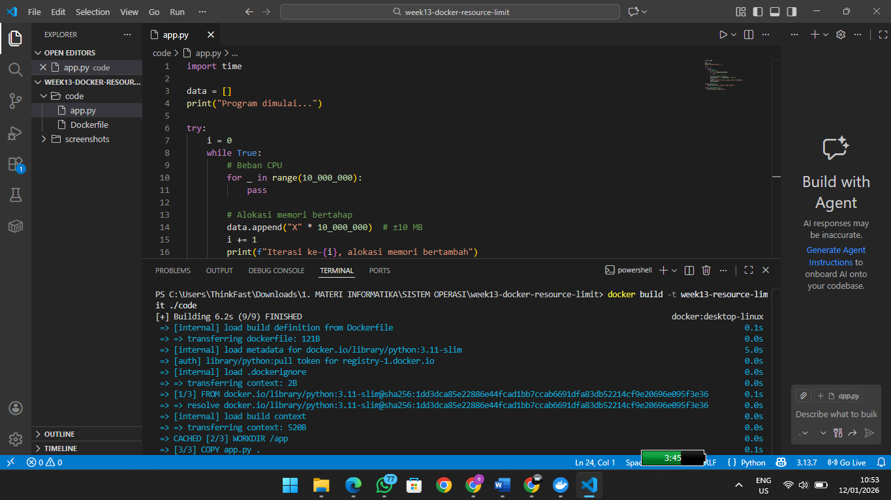
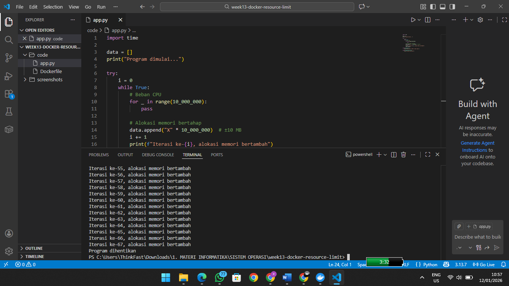
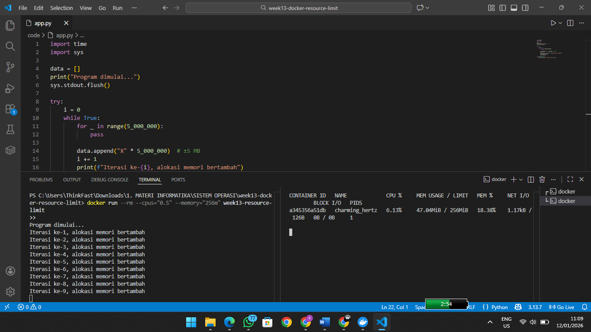

# Laporan Praktikum Minggu XIII
Topik: Docker – Resource Limit (CPU & Memori)

---

## Identitas
- **Nama**  : ERVITA DWI RIYANTI 
- **NIM**   : 250202977  
- **Kelas** : 1IKRA

---

## Tujuan
Setelah menyelesaikan tugas ini, mahasiswa mampu:
1. Menulis Dockerfile sederhana untuk sebuah aplikasi/skrip.
2. Membangun image dan menjalankan container.
3. Menjalankan container dengan pembatasan **CPU** dan **memori**.
4. Mengamati dan menjelaskan perbedaan eksekusi container dengan dan tanpa limit resource.
5. Menyusun laporan praktikum secara runtut dan sistematis.

---

## Dasar Teori

1. Containerization memungkinkan aplikasi berjalan dalam lingkungan terisolasi dengan berbagi kernel sistem operasi host, sehingga lebih ringan dan efisien dibandingkan mesin virtual.

2. Control Groups (cgroups), docker menggunakan mekanisme cgroups pada Linux untuk membatasi penggunaan resource seperti CPU dan memori pada container.

3. Resource Limiting, pembatasan CPU dan memori mencegah container menggunakan resource secara berlebihan, serta dapat menghentikan container secara otomatis ketika batas memori terlampaui (OOM Kill).
---

## Ketentuan Teknis
- Sistem operasi host bebas (Windows/macOS/Linux). Disarankan memakai **Docker Desktop** (atau Docker Engine di Linux).
- Program berbasis **terminal**.
- Fokus penilaian pada **keberhasilan build & run container**, **penerapan resource limit**, serta **kualitas analisis**.

Struktur folder (sesuaikan dengan template repo):
```
praktikum/week13-docker-resource-limit/
├─ code/
│  ├─ Dockerfile
│  └─ app.*
├─ screenshots/
│  └─ hasil_limit.png
└─ laporan.md
```

---

## Langkah Pengerjaan
1. **Persiapan Lingkungan**

   - Pastikan Docker terpasang dan berjalan.
   - Verifikasi:
     ```bash
     docker version
     docker ps
     ```

2. **Membuat Aplikasi/Skrip Uji**

   Buat program sederhana di folder `code/` (bahasa bebas) yang:
   - Melakukan komputasi berulang (untuk mengamati limit CPU), dan/atau
   - Mengalokasikan memori bertahap (untuk mengamati limit memori).

3. **Membuat Dockerfile**

   - Tulis `Dockerfile` untuk menjalankan program uji.
   - Build image:
     ```bash
     docker build -t week13-resource-limit .
     ```

4. **Menjalankan Container Tanpa Limit**

   - Jalankan container normal:
     ```bash
     docker run --rm week13-resource-limit
     ```
   - Catat output/hasil pengamatan.

5. **Menjalankan Container Dengan Limit Resource**

   Jalankan container dengan batasan resource (contoh):
   ```bash
   docker run --rm --cpus="0.5" --memory="256m" week13-resource-limit
   ```
   Catat perubahan perilaku program (mis. lebih lambat, error saat memori tidak cukup, dll.).

6. **Monitoring Sederhana**

   - Jalankan container (tanpa `--rm` jika perlu) dan amati penggunaan resource:
     ```bash
     docker stats
     ```
   - Ambil screenshot output eksekusi dan/atau `docker stats`.

7. **Commit & Push**

   ```bash
   git add .
   git commit -m "Minggu 13 - Docker Resource Limit"
   git push origin main
   ```

---

## Kode app.py

```bash
import time
import sys

data = []
print("Program dimulai...")
sys.stdout.flush()

try:
    i = 0
    while True:
        for _ in range(5_000_000):
            pass

        data.append("X" * 5_000_000)  # ±5 MB
        i += 1
        print(f"Iterasi ke-{i}, alokasi memori bertambah")
        sys.stdout.flush()
        time.sleep(1)

except MemoryError:
    print("MemoryError: Memori tidak cukup!")
```
Aplikasi uji dibuat menggunakan bahasa pemrograman Python dengan tujuan utama:

1. Menghasilkan beban CPU melalui proses komputasi berulang.

2. Mengonsumsi memori secara bertahap melalui alokasi data berukuran besar.

Program dijalankan dalam loop tanpa batas (while True) sehingga:

1. Tanpa pembatasan resource, program akan berjalan terus.

2. Dengan pembatasan resource, sistem akan menghentikan proses ketika batas tercapai.

Pada tahap ini belum terjadi pembatasan apa pun karena program masih dijalankan di lingkungan host melalui container Docker.

---

## Proses Pengerjaan

A. Pembuatan Dockerfile

Dockerfile dibuat untuk membangun image berbasis Python dan menjalankan program uji di dalam container. Dockerfile menggunakan image python:3.10-slim agar ukuran image tetap ringan.

```
FROM python:3.11-slim

WORKDIR /app

COPY app.py .

CMD ["python", "app.py"]
```
---

B. Build Docker Image



Setelah aplikasi selesai dibuat, Dockerfile disusun untuk menentukan base image Python, menyalin file aplikasi ke dalam container, menjalankan aplikasi saat container dijalankan.

Proses build image dilakukan menggunakan perintah:

```
docker build -t week13-resource-limit ./code
```


C. Menjalankan Container Tanpa Limit Resource




```
docker run --rm week13-resource-limit
```

Hasil pengamatan:

Program berjalan secara normal dan menampilkan output di terminal. Output juga muncul secara berkala. Setiap iterasi menunjukkan bahwa memori terus dialokasikan. Tidak terdapat error atau penghentian otomatis dari Docker.
Container terus berjalan tanpa batas waktu. 

Tetapi container tidak berhenti secara otomatis. Proses harus dihentikan secara manual menggunakan CTRL + C. Hal ini terjadi karena docker tidak diberi batas CPU maupun memori, container bebas menggunakan seluruh resource yang tersedia pada host dan sistem operasi tidak menghentikan proses karena tidak ada pelanggaran batas resource.

D. Menjalankan Container Dengan Limit Resource dan Monitoring Docker stats



```
docker run --rm --cpus="0.5" --memory="256m" week13-resource-limit
```
Hasil pengamatan:

Container langsung berhenti dan tidak muncul output di terminal. Terminal langsung kembali ke prompt. Hasil Monitoring menunjukan bahwa container dihentikan ketika penggunaan memori melebihi batas yang ditentukan.
Kondisi ini terjadi karena:

1. Docker membatasi memori container maksimal 256 MB.

2. Program Python langsung mengalokasikan memori dalam jumlah besar.

3. Saat penggunaan memori melebihi batas, kernel Linux mendeteksi kondisi Out Of Memory.

4. Melalui mekanisme cgroups, Docker menghentikan container secara paksa (OOM Kill).

5. Proses dihentikan sebelum sempat mengirimkan output ke terminal.

Dengan kata lain, ketiadaan output bukan error, melainkan akibat container dihentikan terlalu cepat.

Monitoring Resource Menggunakan docker stats

Monitoring resource dilakukan menggunakan perintah:

```
docker stats
```

Pada container yang berjalan dengan limit terlihat penggunaan memori meningkat cepat hingga mendekati batas 256 MB dan container berhenti ketika batas terlampaui. Hal ini memperkuat bukti bahwa pembatasan memori bekerja sesuai konfigurasi.


---

## Analisis

| Aspek             | Tanpa Limit     | Dengan Limit   |
| ----------------- | --------------- | -------------- |
| Output program    | Muncul          | Tidak muncul   |
| Durasi container  | Tidak terbatas  | Sangat singkat |
| Penghentian       | Manual (CTRL+C) | Otomatis       |
| Penyebab berhenti | User            | OOM Kill       |


  Berdasarkan hasil praktikum yang telah dilakukan, terlihat perbedaan yang signifikan antara eksekusi container Docker tanpa pembatasan resource dan dengan pembatasan CPU serta memori. Pada saat container dijalankan tanpa limit resource, aplikasi Python dapat berjalan secara terus-menerus dan menampilkan output secara berkala di terminal. Hal ini terjadi karena container tidak dibatasi dalam penggunaan CPU maupun memori, sehingga sistem operasi tidak melakukan intervensi terhadap proses yang berjalan. Akibatnya, container tidak berhenti secara otomatis dan harus dihentikan secara manual oleh pengguna menggunakan perintah CTRL + C.

  Sebaliknya, ketika container dijalankan dengan pembatasan CPU sebesar 0,5 core dan memori sebesar 256 MB, perilaku aplikasi berubah secara drastis. Container langsung berhenti setelah dijalankan tanpa menampilkan output apa pun di terminal. Kondisi ini bukan disebabkan oleh kesalahan pada program, melainkan karena aplikasi segera mengalokasikan memori dalam jumlah besar sehingga melampaui batas memori yang telah ditentukan. Ketika batas tersebut terlampaui, kernel Linux melalui mekanisme control groups (cgroups) mendeteksi kondisi Out Of Memory dan menghentikan proses container secara paksa (OOM Kill).

  Penghentian container yang terjadi secara tiba-tiba menyebabkan aplikasi tidak memiliki kesempatan untuk mengirimkan output ke standard output, sehingga tidak terlihat pesan apa pun pada terminal. Hal ini menunjukkan bahwa pembatasan memori pada Docker bekerja secara ketat dan memiliki prioritas lebih tinggi dibandingkan proses aplikasi yang berjalan di dalam container. Dengan kata lain, sistem akan lebih mengutamakan stabilitas dan keamanan resource dibandingkan kelangsungan eksekusi aplikasi.

  Hasil praktikum ini membuktikan bahwa mekanisme pembatasan resource pada Docker sangat efektif dalam mengontrol penggunaan CPU dan memori oleh container. Pembatasan tersebut mencegah satu aplikasi mengonsumsi sumber daya secara berlebihan yang dapat berdampak negatif pada sistem host maupun container lain yang berjalan secara bersamaan. Oleh karena itu, penerapan limit resource pada Docker menjadi aspek penting dalam pengelolaan aplikasi berbasis container, terutama pada lingkungan produksi dan sistem dengan banyak layanan.

---

## Kesimpulan
Berdasarkan hasil praktikum dapat disimpulkan bahwa:

1. Docker mampu membatasi penggunaan CPU dan memori pada container.

2. Container tanpa pembatasan resource dapat berjalan terus tanpa berhenti otomatis.

3. Container dengan pembatasan memori akan dihentikan secara otomatis ketika melebihi batas yang ditentukan.

4. Pembatasan resource sangat penting untuk menjaga stabilitas sistem dan mencegah satu container menghabiskan seluruh sumber daya host.

---

## Quiz
1. Mengapa container perlu dibatasi CPU dan memori?
   **Jawaban:**
  Pembatasan CPU dan memori diperlukan agar satu container tidak menghabiskan seluruh resource sistem, sehingga stabilitas dan kinerja aplikasi lain tetap terjaga.
2. Apa perbedaan VM dan container dalam konteks isolasi resource?
   **Jawaban:**
  VM mengisolasi resource dengan sistem operasi terpisah di atas hypervisor, sedangkan container berbagi kernel host dan membatasi resource menggunakan mekanisme sistem operasi, sehingga container lebih ringan dibandingkan VM.
3. Apa dampak limit memori terhadap aplikasi yang boros memori?
   **Jawaban:**  Aplikasi yang boros memori akan dihentikan secara otomatis ketika melebihi batas memori yang ditentukan (OOM Kill), sehingga aplikasi dapat berhenti tiba-tiba.

---

## Refleksi Diri
Tuliskan secara singkat:
- Apa bagian yang paling menantang minggu ini?  
- Bagaimana cara Anda mengatasinya?  

---

**Credit:**  
_Template laporan praktikum Sistem Operasi (SO-202501) – Universitas Putra Bangsa_
