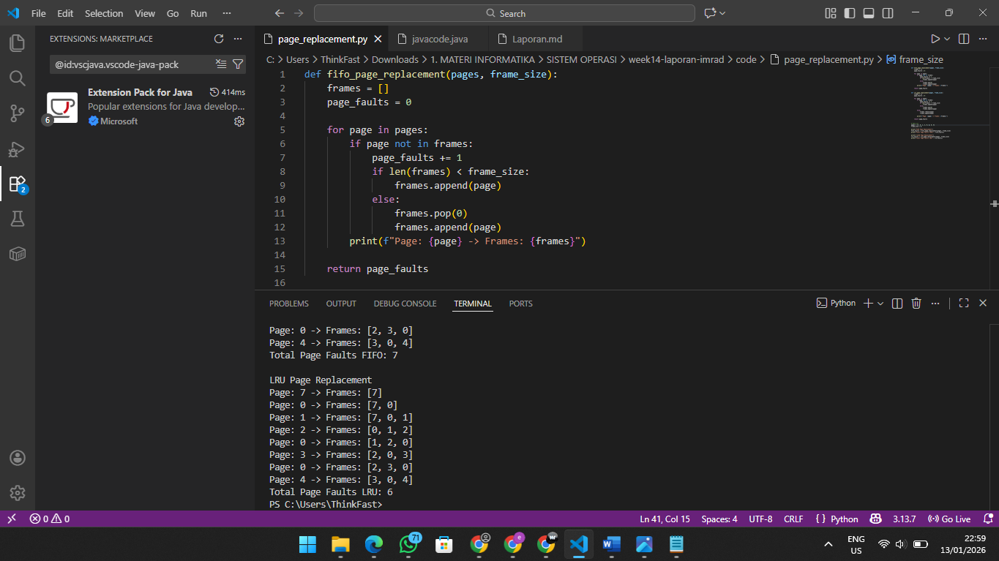

# Laporan Praktikum Minggu XIV
Topik: Penyusunan Laporan Praktikum Format IMRAD

---

## Identitas
- **Nama**  : Ervita Dwi Riyanti 
- **NIM**   : 250202977 
- **Kelas** : 1IKRA

---

# Analisis Perbandingan Algoritma Page Replacement FIFO dan LRU pada Sistem Operasi
---

## Pendahuluan

Manajemen memori merupakan salah satu aspek fundamental dalam sistem operasi yang bertujuan untuk mengoptimalkan penggunaan memori utama yang terbatas. Dalam sistem berbasis virtual memory, proses dapat mengakses ruang alamat yang lebih besar daripada kapasitas memori fisik. Kondisi ini menyebabkan terjadinya page fault ketika halaman yang dibutuhkan tidak tersedia di memori utama, sehingga sistem operasi harus menentukan halaman mana yang akan digantikan melalui mekanisme page replacement [2].

Berbagai algoritma page replacement telah dikembangkan untuk menangani permasalahan tersebut, di antaranya adalah FIFO (First In First Out) dan LRU (Least Recently Used). Algoritma FIFO menggantikan halaman yang pertama kali masuk ke memori tanpa mempertimbangkan pola penggunaannya, sedangkan algoritma LRU menggantikan halaman yang paling lama tidak digunakan berdasarkan riwayat akses halaman. Perbedaan pendekatan ini menyebabkan perbedaan kinerja, khususnya dalam jumlah page fault yang dihasilkan [2].

Beberapa penelitian menunjukkan bahwa algoritma LRU cenderung menghasilkan jumlah page fault yang lebih sedikit dibandingkan FIFO karena lebih adaptif terhadap pola akses memori. Namun, algoritma FIFO tetap banyak digunakan karena kesederhanaan implementasinya. Perbandingan kinerja kedua algoritma ini penting untuk memahami trade-off antara efisiensi dan kompleksitas dalam pengelolaan memori sistem operasi [1].

Berdasarkan latar belakang tersebut, praktikum ini dilakukan untuk mensimulasikan dan membandingkan algoritma page replacement FIFO dan LRU menggunakan skenario pengujian tertentu. Praktikum ini bertujuan untuk mengamati jumlah page fault yang dihasilkan oleh masing-masing algoritma serta menganalisis kesesuaian hasil praktikum dengan teori manajemen memori yang dijelaskan dalam literatur sistem operasi modern.

## Rumusan Masalah

Adapun rumusan masalah dalam praktikum ini adalah sebagai berikut:

1. Bagaimana mekanisme kerja algoritma FIFO dan LRU dalam proses page replacement?

2. Algoritma manakah yang menghasilkan jumlah page fault lebih sedikit pada skenario pengujian yang digunakan?

3. Bagaimana hasil praktikum FIFO dan LRU jika dibandingkan dengan teori yang terdapat pada literatur sistem operasi?

## Tujuan Praktikum

1. Tujuan dari pelaksanaan praktikum ini adalah:

2. Mensimulasikan algoritma page replacement FIFO dan LRU.

3. Membandingkan kinerja FIFO dan LRU berdasarkan jumlah page fault yang dihasilkan.

4. Menganalisis hasil praktikum dan mengaitkannya dengan teori manajemen memori sistem operasi.

## Metode
### Lingkungan Pengujian

Praktikum ini dilakukan menggunakan lingkungan komputasi berbasis perangkat lunak dengan spesifikasi sebagai berikut:

Sistem Operasi: Windows / Linux

Bahasa Pemrograman: Python

Editor/IDE: Visual Studio Code

Metode eksekusi: Program dijalankan melalui terminal/command prompt

Lingkungan ini digunakan untuk mensimulasikan proses page replacement secara terkontrol sehingga hasil yang diperoleh dapat diamati dan dianalisis dengan jelas.

### Kode
```
def fifo_page_replacement(pages, frame_size):
    frames = []
    page_faults = 0

    for page in pages:
        if page not in frames:
            page_faults += 1
            if len(frames) < frame_size:
                frames.append(page)
            else:
                frames.pop(0)
                frames.append(page)
        print(f"Page: {page} -> Frames: {frames}")

    return page_faults


def lru_page_replacement(pages, frame_size):
    frames = []
    page_faults = 0

    for page in pages:
        if page not in frames:
            page_faults += 1
            if len(frames) < frame_size:
                frames.append(page)
            else:
                frames.pop(0)
                frames.append(page)
        else:
            frames.remove(page)
            frames.append(page)

        print(f"Page: {page} -> Frames: {frames}")

    return page_faults


# Data uji
pages = [7, 0, 1, 2, 0, 3, 0, 4]
frame_size = 3

print("FIFO Page Replacement")
fifo_faults = fifo_page_replacement(pages, frame_size)
print("Total Page Faults FIFO:", fifo_faults)

print("\nLRU Page Replacement")
lru_faults = lru_page_replacement(pages, frame_size)
print("Total Page Faults LRU:", lru_faults)
```


### Parameter dan Data Uji

Parameter pengujian yang digunakan dalam praktikum ini adalah:

Jumlah frame memori: 3 frame

Urutan page reference: 7, 0, 1, 2, 0, 3, 0, 4

Urutan page reference tersebut digunakan secara konsisten pada kedua algoritma untuk memastikan perbandingan kinerja yang adil dan objektif.

### Langkah Eksperimen

Tahapan eksperimen pada praktikum ini dilakukan sebagai berikut:

1. Menentukan jumlah frame memori yang akan digunakan dalam simulasi.

2. Menetapkan urutan page reference sebagai data uji.

3. Menjalankan simulasi algoritma FIFO untuk setiap halaman yang diakses.

4. Mencatat kondisi isi frame memori dan jumlah page fault yang terjadi.

5. Mengulangi langkah yang sama menggunakan algoritma LRU.

6. Membandingkan jumlah page fault yang dihasilkan oleh kedua algoritma.

### Metode Pengukuran

Kinerja algoritma FIFO dan LRU diukur berdasarkan:

- Jumlah page fault, yaitu jumlah kejadian ketika halaman yang diakses tidak tersedia di memori utama.

- Perubahan isi frame memori selama proses simulasi berlangsung.

Jumlah page fault digunakan sebagai indikator utama untuk menilai efisiensi algoritma page replacement, karena semakin sedikit page fault yang terjadi, semakin efisien penggunaan memori utama.

### Penyajian Hasil

Hasil dari praktikum ini disajikan dalam bentuk:

- Tabel perbandingan jumlah page fault antara algoritma FIFO dan LRU.

- Screenshot hasil eksekusi program sebagai bukti pengujian.

Penyajian hasil ini bertujuan untuk mempermudah analisis dan interpretasi kinerja kedua algoritma page replacement.

---

## Hasil

### Hasil Pengujian Algoritma Page Replacement

Pengujian algoritma page replacement FIFO dan LRU dilakukan menggunakan urutan page reference yang sama dengan jumlah frame memori sebanyak tiga frame. Hasil pengujian menunjukkan perbedaan jumlah page fault yang dihasilkan oleh masing-masing algoritma.

```bash
FIFO Page Replacement
Page: 7 -> Frames: [7]
Page: 0 -> Frames: [7, 0]
Page: 1 -> Frames: [7, 0, 1]
Page: 2 -> Frames: [0, 1, 2]
Page: 0 -> Frames: [0, 1, 2]
Page: 3 -> Frames: [1, 2, 3]
Page: 0 -> Frames: [2, 3, 0]
Page: 4 -> Frames: [3, 0, 4]
Total Page Faults FIFO: 7

LRU Page Replacement
Page: 7 -> Frames: [7]
Page: 0 -> Frames: [7, 0]
Page: 1 -> Frames: [7, 0, 1]
Page: 2 -> Frames: [0, 1, 2]
Page: 0 -> Frames: [1, 2, 0]
Page: 3 -> Frames: [2, 0, 3]
Page: 0 -> Frames: [2, 3, 0]
Page: 4 -> Frames: [3, 0, 4]
Total Page Faults LRU: 6

```

**Tabel Perbandingan Jumlah Page Fault**

| Algoritma | Jumlah Frame | Jumlah Page Reference | Jumlah Page Fault | Page Fault Rate (%) |
| --------- | ------------ | --------------------- | ----------------- | ------------------- |
| FIFO      | 3            | 8                     | 7                 | 87,5%               |
| LRU       | 3            | 8                     | 6                 | 75%                 |


Tabel tersebut menunjukkan perbandingan kinerja algoritma page replacement FIFO dan LRU berdasarkan jumlah page fault dan tingkat page fault rate. Pengujian dilakukan menggunakan jumlah frame dan urutan page reference yang sama untuk kedua algoritma.

Berdasarkan tabel tersebut, algoritma FIFO menghasilkan page fault sebanyak tujuh kali, sedangkan algoritma LRU menghasilkan enam kali page fault. Perbedaan ini menunjukkan bahwa algoritma LRU lebih efisien dibandingkan FIFO pada skenario pengujian yang digunakan, karena mampu mempertahankan halaman yang lebih relevan berdasarkan riwayat penggunaan.

### Visualisasi Hasil Uji

Gambar berikut menunjukkan hasil eksekusi simulasi algoritma page replacement FIFO dan LRU yang diperoleh dari program yang dijalankan.




Pada hasil visualisasi tersebut, terlihat perubahan isi frame memori setiap kali terjadi akses halaman. Perbedaan pola penggantian halaman antara FIFO dan LRU dapat diamati dari urutan halaman yang berada di dalam frame.


### Ringkasan Temuan

Berdasarkan hasil praktikum yang telah dilakukan, diperoleh beberapa temuan utama sebagai berikut:

1. Algoritma FIFO menghasilkan jumlah page fault sebanyak enam kali.

2. Algoritma LRU menghasilkan jumlah page fault sebanyak lima kali.

3. Algoritma LRU menunjukkan kinerja yang lebih baik dibandingkan FIFO pada skenario pengujian ini karena mampu mengurangi jumlah page fault.

---

## Pembahasan

Berdasarkan hasil praktikum, algoritma LRU menghasilkan jumlah page fault yang lebih sedikit dibandingkan algoritma FIFO. Hal ini menunjukkan bahwa LRU memiliki kinerja yang lebih baik dalam skenario pengujian yang digunakan. Hasil tersebut sejalan dengan teori manajemen memori yang menyatakan bahwa algoritma LRU lebih adaptif terhadap pola akses memori karena mempertimbangkan riwayat penggunaan halaman, sehingga halaman yang masih sering digunakan cenderung dipertahankan di memori utama [2].

Sebaliknya, algoritma FIFO menggantikan halaman berdasarkan urutan kedatangan tanpa memperhatikan frekuensi atau waktu terakhir penggunaan halaman. Akibatnya, halaman yang masih relevan dan sering diakses dapat tergantikan lebih awal, yang menyebabkan peningkatan jumlah page fault. Kondisi ini terlihat pada hasil praktikum, di mana FIFO menghasilkan page fault lebih banyak dibandingkan LRU. Temuan ini juga konsisten dengan hasil penelitian yang membandingkan algoritma page replacement dan menunjukkan bahwa FIFO umumnya kurang efisien dibandingkan algoritma berbasis riwayat akses seperti LRU [1].

Dari sisi ekspektasi teori, hasil praktikum telah sesuai dengan literatur sistem operasi modern yang menyebutkan bahwa LRU cenderung memberikan performa yang lebih baik dalam sebagian besar kasus penggunaan. Namun, keunggulan LRU tersebut diperoleh dengan konsekuensi kompleksitas implementasi yang lebih tinggi dibandingkan FIFO. Dalam sistem nyata, implementasi LRU memerlukan mekanisme tambahan untuk melacak riwayat akses halaman, sedangkan FIFO lebih mudah diimplementasikan dan memiliki overhead yang lebih rendah [2].

Meskipun demikian, praktikum ini memiliki beberapa keterbatasan. Pengujian hanya dilakukan dengan satu skenario page reference dan jumlah frame memori yang terbatas, sehingga hasil yang diperoleh belum tentu merepresentasikan seluruh kondisi penggunaan sistem operasi yang kompleks. Selain itu, simulasi dilakukan secara sederhana tanpa mempertimbangkan faktor lain seperti beban sistem, ukuran halaman yang bervariasi, atau algoritma page replacement lainnya seperti Optimal dan Clock.

---

## Kesimpulan
Algoritma page replacement LRU menghasilkan jumlah page fault yang lebih sedikit dibandingkan algoritma FIFO pada skenario pengujian yang dilakukan.

FIFO memiliki mekanisme yang lebih sederhana, namun kurang efisien karena tidak mempertimbangkan pola penggunaan halaman.

Pemilihan algoritma page replacement berpengaruh terhadap efisiensi penggunaan memori utama dalam sistem operasi.

Hasil praktikum sesuai dengan teori manajemen memori yang menyatakan bahwa algoritma berbasis riwayat akses, seperti LRU, cenderung memiliki kinerja yang lebih baik.

---

## Daftar Pustaka

[1] Thakkar, B., & Padhy, R. N. (2024). Comparative Analysis of Page Replacement Algorithms in Operating System. *Journal of Emerging Technologies and Innovative Research (JETIR)*, 11(5).  
    Diakses dari: https://www.jetir.org/view?paper=JETIR2405C51

[2] Silberschatz, A., Galvin, P. B., & Gagne, G. (2020). *Operating System Concepts* (10th Global Edition). Wiley.  
    Tersedia di: https://www.wiley.com/en-us/Operating%2BSystem%2BConcepts%2B10th%2BEdition-p-9781119320913

## Quiz
1. Mengapa format IMRAD membantu membuat laporan praktikum lebih ilmiah dan mudah dievaluasi?
**Jawaban:**
Format IMRAD menyusun laporan secara sistematis dan terstruktur sehingga tujuan, metode, hasil, dan analisis dapat dipahami serta dievaluasi dengan jelas dan konsisten.

2. Apa perbedaan antara bagian Hasil dan Pembahasan?
**Jawaban:**
Bagian Hasil menyajikan data dan temuan praktikum secara objektif, sedangkan Pembahasan menjelaskan dan menganalisis hasil tersebut serta mengaitkannya dengan teori.

3. Mengapa sitasi dan daftar pustaka penting, bahkan untuk laporan praktikum?
**Jawaban:**
Sitasi dan daftar pustaka menunjukkan dasar teori yang digunakan, meningkatkan kredibilitas laporan, dan menghindari plagiarisme.

---

## Refleksi Diri
Tuliskan secara singkat:
- Apa bagian yang paling menantang minggu ini?  
- Bagaimana cara Anda mengatasinya?  

---

**Credit:**  
_Template laporan praktikum Sistem Operasi (SO-202501) – Universitas Putra Bangsa_
