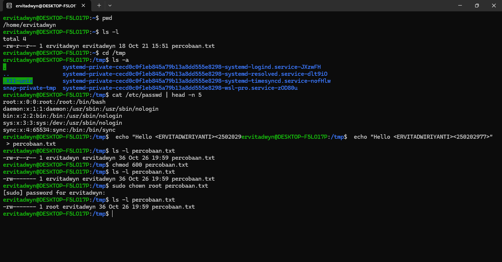

# Laporan Praktikum Minggu III
Topik: Manajemen File dan Permission di Linux

---

## Identitas
- **Nama**  : ERVITA DWI RIYANTI
- **NIM**   : 250202977
- **Kelas** : 1IKRA

---

## Tujuan
Setelah menyelesaikan tugas ini, mahasiswa mampu:
1. Menggunakan perintah `ls`, `pwd`, `cd`, `cat` untuk navigasi file dan direktori.
2. Menggunakan `chmod` dan `chown` untuk manajemen hak akses file.
3. Menjelaskan hasil output dari perintah Linux dasar.
4. Menyusun laporan praktikum dengan struktur yang benar.
5. Mengunggah dokumentasi hasil ke Git Repository tepat waktu.
---

## Dasar Teori

1. Navigasi Sistem File (Perintah Dasar Linux):
   
Perintah seperti pwd, ls -l, dan cd digunakan untuk menampilkan direktori aktif, melihat isi folder dengan detail, serta berpindah antar direktori dalam sistem file Linux.

2. File Tersembunyi dan Direktori Sementara:

Opsi ls -a menampilkan semua file termasuk yang tersembunyi (diawali dengan titik .). Direktori /tmp adalah direktori sementara yang digunakan sistem atau pengguna untuk menyimpan file sementara.

3. Membaca dan Menulis File di Linux:

Perintah cat digunakan untuk menampilkan isi file (contohnya /etc/passwd), sedangkan echo "teks" > nama_file digunakan untuk membuat file baru atau menulis data ke dalam file.

4. Manajemen Hak Akses File:

Perintah chmod mengatur hak akses file (misalnya chmod 600 berarti hanya pemilik yang bisa membaca dan menulis file).
Perintah chown mengubah kepemilikan file, seperti mengganti pemilik menjadi root.

5. Konsep User dan Permission:

Linux adalah sistem multiuser, sehingga setiap file memiliki atribut pemilik (owner), grup, dan izin (permission). Kombinasi ketiganya memastikan keamanan dan pembatasan akses antar pengguna.

---

## Langkah Praktikum
1. **Setup Environment**
   - Gunakan Linux (Ubuntu/WSL).
   - Pastikan folder kerja berada di dalam direktori repositori Git praktikum:
     ```
     praktikum/week3-linux-fs-permission/
     ```

2. **Eksperimen 1 – Navigasi Sistem File**
   Jalankan perintah berikut:
   ```bash
   pwd
   ls -l
   cd /tmp
   ls -a
   ```
   - Jelaskan hasil tiap perintah.
   - Catat direktori aktif, isi folder, dan file tersembunyi (jika ada).

3. **Eksperimen 2 – Membaca File**
   Jalankan perintah:
   ```bash
   cat /etc/passwd | head -n 5
   ```
   - Jelaskan isi file dan struktur barisnya (user, UID, GID, home, shell).

4. **Eksperimen 3 – Permission & Ownership**
   Buat file baru:
   ```bash
   echo "Hello <NAME><NIM>" > percobaan.txt
   ls -l percobaan.txt
   chmod 600 percobaan.txt
   ls -l percobaan.txt
   ```
   - Analisis perbedaan sebelum dan sesudah chmod.  
   - Ubah pemilik file (jika memiliki izin sudo):
   ```bash
   sudo chown root percobaan.txt
   ls -l percobaan.txt
   ```
   - Catat hasilnya.

5. **Eksperimen 4 – Dokumentasi**
   - Ambil screenshot hasil terminal dan simpan di:
     ```
     praktikum/week3-linux-fs-permission/screenshots/
     ```
   - Tambahkan analisis hasil pada `laporan.md`.

6. **Commit & Push**
   ```bash
   git add .
   git commit -m "Minggu 3 - Linux File System & Permission"
   git push origin main
   ```
---

## Kode / Perintah
Tuliskan potongan kode atau perintah utama:
 ```bash
   pwd
   ls -l
   cd /tmp
   ls -a
   ```
 ```bash
   cat /etc/passwd | head -n 5
   ```
```bash
   echo "Hello <NAME><NIM>" > percobaan.txt
   ls -l percobaan.txt
   chmod 600 percobaan.txt
   ls -l percobaan.txt
   ```
 ```bash
   sudo chown root percobaan.txt
   ls -l percobaan.txt
   ```

---

## Hasil Eksekusi
Sertakan screenshot hasil percobaan atau diagram:


---

## Eksperimen 1
1. Perintah: pwd
   Memiliki fungsi untuk menampilkan direktori kerja (current working directory) tempat user berada saat ini.

Hasil:
```bash
/home/ervitadwyn
```
Analisis:
Menunjukkan bahwa user sedang berada di direktori home milik pengguna bernama ervitadwyn.

2. Perintah: ls -l
   Memiliki fungsi menampilkan daftar isi direktori dalam format panjang (long listing), yang mencakup:
   -Jenis file dan izin (permission)
   -Jumlah link
   -Pemilik (owner)
   -Grup
   -Ukuran file (byte)
   -Tanggal dan waktu modifikasi
   -Nama file atau folder

Hasil:
```bash
-rw-r--r-- 1 ervitadwyn ervitadwyn ... percobaan.txt
```
Analisis:
Isi folder hanya ada satu file yaitu percobaan.txt, dengan izin:
-Pemilik: baca dan tulis (rw-)
-Grup: baca (r--)
-Lainnya: baca (r--)

3. Perintah: cd /tmp
   Memiliki fungsi untuk berpindah ke direktori sementara (temporary directory) milik sistem Linux.

Hasil:
Tidak ada pesan error, artinya perintah berhasil dijalankan.
-Direktori aktif sekarang: /tmp

4. Perintah: ls -a
   Memiliki fungsi menampilkan semua isi direktori, termasuk file tersembunyi (yang diawali dengan tanda titik .).

Hasil:
```bash
.  
..  
.X11-unix  
snap-private-tmp  
systemd-private-...  
```
Analisis:

. → Menunjukkan direktori saat ini.

.. → Menunjukkan direktori induk (parent directory).

.X11-unix → Folder tersembunyi yang digunakan sistem untuk komunikasi grafis (X11).

Folder systemd-private-... → Folder sementara yang dibuat otomatis oleh sistem untuk proses tertentu.

File tersembunyi yang ditemukan: .X11-unix

- Kesimpulan:

| **No.** | **Perintah** | **Fungsi Utama**                                                    | **Hasil yang Ditampilkan**                    | **Kesimpulan**                                                  |
| :-----: | :----------- | :------------------------------------------------------------------ | :-------------------------------------------- | :-------------------------------------------------------------- |
|    1    | `pwd`        | Menampilkan direktori kerja aktif                                   | `/home/ervitadwyn`                            | Menunjukkan posisi pengguna berada di direktori home miliknya.  |
|    2    | `ls -l`      | Menampilkan isi folder secara detail (izin, pemilik, ukuran, waktu) | `percobaan.txt`                               | Folder berisi satu file dengan izin akses untuk semua pengguna. |
|    3    | `cd /tmp`    | Berpindah ke direktori sementara sistem                             | Tidak menampilkan output (berhasil berpindah) |                                                                 |

## Eksperimen 2
Perintah:
```bash
cat /etc/passwd | head -n 5
```
Memiliki fungsi untuk menampilkan isi file /etc/passwd yang berisi daftar semua user (pengguna) yang terdaftar di sistem Linux.
| head -n 5 → hanya menampilkan 5 baris pertama dari isi file tersebut.
seperti :
```bash
root:x:0:0:root:/bin/bash
daemon:x:1:1:daemon:/usr/sbin/nologin
bin:x:2:2:bin:/usr/sbin/nologin
sys:x:3:3:sys:/usr/sbin/nologin
sync:x:4:65534:sync:/bin/sync
```
Struktur Setiap Baris /etc/passwd

Setiap baris berisi informasi tentang satu akun pengguna dengan 7 kolom yang dipisahkan oleh tanda titik dua (:):
|  No | Kolom       | Nama Field            | Keterangan                                                                                                            |
| :-: | :---------- | :-------------------- | :-------------------------------------------------------------------------------------------------------------------- |
|  1  | `root`      | **Username**          | Nama akun pengguna (login name).                                                                                      |
|  2  | `x`         | **Password**          | Dulu berisi password terenkripsi, sekarang digantikan dengan `x` karena password disimpan di file lain `/etc/shadow`. |
|  3  | `0`         | **UID (User ID)**     | Nomor identitas unik untuk pengguna. UID 0 = superuser (root).                                                        |
|  4  | `0`         | **GID (Group ID)**    | Nomor identitas grup utama pengguna.                                                                                  |
|  5  | `root`      | **GECOS / Deskripsi** | Keterangan singkat (biasanya nama lengkap atau info tambahan).                                                        |
|  6  | `/root`     | **Home Directory**    | Lokasi direktori utama milik pengguna.                                                                                |
|  7  | `/bin/bash` | **Login Shell**       | Shell default yang dijalankan ketika user login (contohnya Bash).         


Contoh Analisis Tiap Baris:

| Baris | Username | UID | GID   | Home Directory    | Shell                                             | Keterangan                                 |
| :---: | :------- | :-- | :---- | :---------------- | :------------------------------------------------ | :----------------------------------------- |
|   1   | root     | 0   | 0     | /root             | /bin/bash                                         | Superuser, memiliki akses penuh ke sistem. |
|   2   | daemon   | 1   | 1     | /usr/sbin/nologin | Tidak bisa login, digunakan untuk layanan sistem. |                                            |
|   3   | bin      | 2   | 2     | /usr/sbin/nologin | Akun sistem untuk menjalankan program biner.      |                                            |
|   4   | sys      | 3   | 3     | /usr/sbin/nologin | Akun sistem untuk proses sistem internal.         |                                            |
|   5   | sync     | 4   | 65534 | /bin/sync         | Akun sistem khusus untuk perintah sinkronisasi.   |                                            |

Kesimpulan:
File /etc/passwd menyimpan data semua akun pengguna di sistem, termasuk akun sistem dan akun manusia.
Setiap baris berisi informasi login, identitas, dan konfigurasi shell pengguna yang digunakan saat sistem berjalan.

## Eksperimen 3

1. Membuat File Baru
```bash
echo "Hello <NAME><NIM>" > percobaan.txt
```
Berfungsi membuat file bernama percobaan.txt dan menuliskan teks Hello <NAME><NIM> ke dalamnya.
Hasilnya file baru percobaan.txt berhasil dibuat di direktori aktif.

Isi file:
Hello <NAME><NIM>

2. Melihat Detail File (Sebelum chmod)
```bash  
ls -l percobaan.txt
```
Contoh hasil:
```bash  
-rw-r--r-- 1 ervitadwyn ervitadwyn 18 Oct 22 21:45 percobaan.txt
```
Analisis hak akses (-rw-r--r--):
- User (ervitadwyn): dapat membaca dan menulis file (rw-)
- Group: hanya dapat membaca (r--)
- Others: hanya dapat membaca (r--)
Artinya semua pengguna bisa membaca file ini, tapi hanya pemilik yang bisa mengubah isinya.

3. Mengubah Hak Akses File
```bash  
chmod 600 percobaan.txt
```
Berfungsi mengatur izin file agar hanya pemilik yang bisa membaca dan menulis file.

4. Melihat Detail File (Sesudah chmod)
```bash  
ls -l percobaan.txt
```
Contoh hasil:
```bash  
-rw------- 1 ervitadwyn ervitadwyn 18 Oct 22 21:45 percobaan.txt
```
Analisis perubahan:
Sebelum chmod 600	Sesudah chmod 600	Perubahan
-rw-r--r--	-rw-------	Grup dan pengguna lain tidak lagi bisa membaca file.

- Kesimpulan perubahan:
chmod 600 memperketat keamanan file agar hanya pemilik (owner) yang dapat mengaksesnya (membaca/menulis), sementara pengguna lain tidak punya izin apa pun.

5. Mengubah Pemilik File (dengan sudo)
```bash
sudo chown root percobaan.txt
```
Berfungsi mengubah pemilik file menjadi root (administrator sistem).

6. Melihat Detail File (Setelah chown)
```bash
ls -l percobaan.txt
```
Contoh hasil:
```bash
-rw------- 1 root ervitadwyn 18 Oct 22 21:45 percobaan.txt
```

Analisis hasil:

Kolom	Sebelum chown	Sesudah chown	Keterangan
Owner	ervitadwyn	root	File kini dimiliki oleh user root
Group	ervitadwyn	ervitadwyn	Grup tetap sama
Permission	rw-------	rw-------	Tidak berubah (masih hanya owner yang bisa akses)

Kesimpulan Akhir Percobaan
No	Perintah	Fungsi	Hasil	Kesimpulan

1.	echo "Hello <NAME><NIM>" > percobaan.txt	Membuat file baru	File percobaan.txt berisi teks Hello	File berhasil dibuat

2.	ls -l percobaan.txt	Menampilkan detail file	-rw-r--r-- ervitadwyn	Semua user bisa membaca file

3.	chmod 600 percobaan.txt	Mengubah izin file	-rw-------	Hanya pemilik bisa membaca/menulis

4.	sudo chown root percobaan.txt	Mengubah pemilik file	owner = root	File menjadi milik user root

5.	ls -l percobaan.txt (akhir)	Melihat hasil akhir	-rw------- 1 root ervitadwyn ...	File kini hanya bisa diakses oleh root

## Analisis
- Analisis perbedaan sebelum dan sesudah chmod :

Sebelum chmod 600 percobaan.txt,   Hasil perintah ls -l percobaan.txt menunjukkan file memiliki izin default:
 ```bash
-rw-r--r-- 1 ervitadwyn ervitadwyn ...
 ```
Berarti pemilik (owner) dapat membaca dan menulis file (rw-), dan grup hanya dapat membaca file (r--),
Lainnya (others) juga hanya dapat membaca file (r--)

Jadi, file dapat dibaca oleh semua pengguna di sistem.

Sesudah chmod 600 percobaan.txt, Setelah diubah dengan chmod 600, hasil perintah ls -l menjadi:
 ```bash
-rw------- 1 ervitadwyn ervitadwyn ...
```
Berarti pemilik (owner) masih dapat membaca dan menulis (rw-), sedangkan Grup tidak punya akses sama sekali (---),
Lainnya: tidak punya akses sama sekali (---)

Jadi, Hanya pemilik file yang bisa membaca atau menulis file. Orang lain, termasuk user lain di sistem, tidak dapat melihat atau mengubah file ini.

Kesimpulan Analisis
Perintah chmod 600 memperketat keamanan file dengan membatasi akses hanya untuk pemiliknya.
Sebelumnya file bisa dibaca oleh siapa pun, tetapi setelah chmod, file menjadi pribadi dan terlindungi dari akses pengguna lain.

### Tugas
1. Dokumentasikan hasil seluruh perintah pada tabel observasi di `laporan.md`.  
2. Jelaskan fungsi tiap perintah dan arti kolom permission (`rwxr-xr--`).  
3. Analisis peran `chmod` dan `chown` dalam keamanan sistem Linux.  
4. Upload hasil dan laporan ke repositori Git sebelum deadline.

## Tabel Observasi Seluruh Perintah

|  No | Perintah                                                     | Hasil / Output Utama                                                                 | Analisis Singkat                                                                                                        |                                                                                                   |
| :-: | :----------------------------------------------------------- | :----------------------------------------------------------------------------------- | :---------------------------------------------------------------------------------------------------------------------- | ------------------------------------------------------------------------------------------------- |
|  1  | `pwd`                                                        | `/home/ervitadwyn`                                                                   | Menunjukkan direktori kerja aktif pengguna saat ini.                                                                    |                                                                                                   |
|  2  | `ls -l`                                                      | `-rw-r--r-- 1 ervitadwyn ervitadwyn ... percobaan.txt`                               | Menampilkan file `percobaan.txt` dengan izin awal: owner dapat membaca & menulis, group dan others hanya dapat membaca. |                                                                                                   |
|  3  | `cd /tmp`                                                    | (Tidak ada output)                                                                   | Berpindah ke direktori sementara `/tmp`.                                                                                |                                                                                                   |
|  4  | `ls -a`                                                      | Menampilkan isi direktori `/tmp`, termasuk file tersembunyi seperti `.` dan `..`.    | Memverifikasi semua file sistem sementara yang aktif.                                                                   |                                                                                                   |
|  5  | `cat /etc/passwd                                             | head -n 5`                                                                           | Menampilkan 5 baris pertama dari daftar user sistem: `root`, `daemon`, `bin`, `sys`, `sync`.                            | File `/etc/passwd` berisi data akun sistem seperti username, UID, GID, direktori home, dan shell. |
|  6  | `echo "Hello <ERVITADWIRIYANTI><250202977>" > percobaan.txt` | Membuat file baru bernama `percobaan.txt` dengan isi teks sesuai identitas pengguna. | Menulis data teks ke file baru menggunakan *redirection operator* (`>`).                                                |                                                                                                   |
|  7  | `ls -l percobaan.txt`                                        | `-rw-r--r-- 1 ervitadwyn ervitadwyn ... percobaan.txt`                               | File baru berhasil dibuat dengan izin default: owner (rw), group (r), others (r).                                       |                                                                                                   |
|  8  | `chmod 600 percobaan.txt`                                    | (Tidak ada output)                                                                   | Mengubah hak akses agar hanya owner dapat membaca dan menulis file.                                                     |                                                                                                   |
|  9  | `ls -l percobaan.txt`                                        | `-rw------- 1 ervitadwyn ervitadwyn ... percobaan.txt`                               | Terlihat izin berubah: group & others tidak lagi memiliki akses.                                                        |                                                                                                   |
|  10 | `sudo chown root percobaan.txt`                              | (Meminta password, lalu berhasil dijalankan)                                         | Mengubah pemilik file dari `ervitadwyn` menjadi `root`.                                                                 |                                                                                                   |
|  11 | `ls -l percobaan.txt`                                        | `-rw------- 1 root ervitadwyn ... percobaan.txt`                                     | Kepemilikan file telah berpindah ke user `root`; hanya root yang bisa mengakses file.                                   |                                                                                                   |

## Fungsi Tiap Perintah 
| Perintah                                                         | Fungsi                                                                                                                                           |                                                                                                                                                                      |
| :--------------------------------------------------------------- | :----------------------------------------------------------------------------------------------------------------------------------------------- | -------------------------------------------------------------------------------------------------------------------------------------------------------------------- |
| **`pwd`**                                                        | Menampilkan direktori kerja (working directory) saat ini. Contoh hasil: `/home/ervitadwyn`.                                                      |                                                                                                                                                                      |
| **`ls -l`**                                                      | Menampilkan daftar file dan direktori dalam format panjang (long listing), lengkap dengan permission, owner, grup, ukuran, dan waktu modifikasi. |                                                                                                                                                                      |
| **`cd /tmp`**                                                    | Berpindah dari direktori saat ini menuju direktori sementara sistem (`/tmp`).                                                                    |                                                                                                                                                                      |
| **`ls -a`**                                                      | Menampilkan semua isi direktori, termasuk file tersembunyi (yang diawali dengan tanda titik `.`).                                                |                                                                                                                                                                      |
| **`cat /etc/passwd                                               | head -n 5`**                                                                                                                                     | Menampilkan 5 baris pertama dari file `/etc/passwd` yang berisi daftar pengguna sistem beserta informasi seperti UID, GID, direktori home, dan shell yang digunakan. |
| **`echo "Hello <ERVITADWIRIYANTI><250202977>" > percobaan.txt`** | Membuat file `percobaan.txt` dan menuliskan teks ke dalamnya menggunakan *redirection operator* (`>`).                                           |                                                                                                                                                                      |
| **`chmod 600 percobaan.txt`**                                    | Mengubah hak akses file menjadi hanya bisa **dibaca dan ditulis oleh owner** (pengguna lain tidak bisa mengakses).                               |                                                                                                                                                                      |
| **`sudo chown root percobaan.txt`**                              | Mengubah pemilik (owner) file dari `ervitadwyn` menjadi `root`.                                                                                  |                                                                                                                                                                      |
| **`ls -l percobaan.txt`**                                        | Mengecek kembali perubahan izin dan kepemilikan file setelah perintah `chmod` dan `chown` dijalankan.                                            |                                                                                                              
## Arti Kolom Permission (`rwxr-xr--`).

| Bagian | Simbol |            Arti            | Penjelasan                                                                         |
| :----: | :----: | :------------------------: | :--------------------------------------------------------------------------------- |
|    1   |   `-`  |         Jenis file         | `-` = file biasa, `d` = direktori, `l` = symbolic link.                            |
|   2–4  |  `rwx` |     **Owner (pemilik)**    | Pemilik file bisa **read (r)**, **write (w)**, dan **execute (x)**.                |
|   5–7  |  `r-x` |      **Group (grup)**      | Anggota grup hanya bisa **read (r)** dan **execute (x)**, tidak bisa menulis file. |
|  8–10  |  `r--` | **Others (pengguna lain)** | Pengguna lain hanya bisa **membaca (r)** tanpa menulis atau menjalankan file.      |


## Peran chmod dan chown dalam keamanan sistem linux

Secara singkat, chmod dan chown berperan penting dalam menjaga keamanan sistem Linux.
chmod mengatur hak akses file (read, write, execute) agar hanya pengguna tertentu yang bisa membacanya, mengedit, atau menjalankannya.
chown menentukan siapa pemilik dan grup file, sehingga tanggung jawab serta batas akses lebih jelas.
Keduanya bekerja bersama untuk mencegah akses tidak sah, melindungi data sensitif, dan menjaga integritas sistem.

- Makna hasil percobaan ini menunjukkan bagaimana sistem operasi Linux mengatur file, direktori, dan hak akses dengan struktur yang jelas dan aman. Melalui percobaan pertama, pengguna memahami cara menavigasi sistem file menggunakan perintah dasar seperti `pwd`, `ls`, `cd`, dan `ls -a`, yang berfungsi untuk mengetahui lokasi kerja, melihat isi direktori, berpindah antar folder, serta menampilkan file tersembunyi. Percobaan selanjutnya pada file `/etc/passwd` memperlihatkan bahwa Linux menyimpan seluruh data pengguna dalam bentuk teks yang mudah dibaca, dengan struktur baris yang mencakup username, UID, GID, direktori home, dan shell login. Ini memberikan pemahaman bahwa setiap akun di sistem memiliki identitas dan konfigurasi tersendiri.
Kemudian, pada percobaan pembuatan dan pengaturan izin file menggunakan `chmod`, terlihat bahwa sistem Linux memiliki mekanisme pengamanan yang kuat. Sebelum perintah `chmod 600` dijalankan, file dapat dibaca oleh semua pengguna; namun setelahnya, hanya pemilik yang memiliki akses baca dan tulis, sementara pengguna lain tidak memiliki izin sama sekali. Hal ini menunjukkan pentingnya pengaturan hak akses untuk menjaga kerahasiaan dan integritas data. Terakhir, perubahan pemilik file dengan `chown` menegaskan adanya hierarki hak akses, di mana hanya pengguna dengan hak administratif (root) yang dapat mengubah kepemilikan file. Secara keseluruhan, percobaan ini bermakna bahwa Linux dirancang dengan sistem keamanan berbasis izin dan kepemilikan yang memastikan setiap file terlindungi serta hanya dapat diakses oleh pengguna yang berhak.

- Hubungkan hasil dengan teori (fungsi kernel, system call, arsitektur OS)
Dalam sistem operasi Linux, kernel berperan sebagai inti utama yang mengatur seluruh interaksi antara perangkat keras dan perangkat lunak. Saat pengguna menjalankan perintah seperti pwd, ls, chmod, atau chown, perintah tersebut sebenarnya tidak langsung berkomunikasi dengan perangkat keras. Perintah itu dikirim ke kernel melalui system call, yaitu antarmuka yang memungkinkan program pengguna (user space) meminta layanan dari sistem operasi (kernel space). Misalnya, ketika perintah ls -l dijalankan, kernel menggunakan system call seperti open(), read(), dan stat() untuk mengambil informasi file dari sistem penyimpanan, lalu mengirim hasilnya kembali ke terminal untuk ditampilkan ke pengguna.
Selain itu, ketika menjalankan chmod dan chown, kernel juga memproses permintaan untuk mengubah metadata file, seperti izin akses (permission bits) dan kepemilikan. Kernel memastikan bahwa hanya pengguna dengan hak yang sesuai (misalnya root) yang dapat melakukan perubahan ini. Hal ini menunjukkan fungsi kernel sebagai pengelola keamanan dan kontrol akses, memastikan setiap proses berjalan sesuai dengan hak istimewanya.
Dari sisi arsitektur sistem operasi, Linux menerapkan arsitektur layered (berlapis), di mana lapisan terluar adalah aplikasi pengguna (shell/terminal), lapisan tengah berisi system call interface, dan lapisan terdalam adalah kernel. Percobaan ini menggambarkan hubungan berlapis tersebut: pengguna memberikan perintah melalui shell (user interface), shell meneruskannya ke kernel melalui system call, dan kernel mengatur interaksi dengan perangkat keras seperti penyimpanan atau memori untuk mengeksekusi perintah.
Dengan demikian, hasil percobaan ini memperlihatkan secara nyata bagaimana teori OS bekerja: kernel sebagai pusat kendali sistem, system call sebagai jembatan komunikasi antara pengguna dan kernel, serta arsitektur berlapis yang menjamin keamanan, stabilitas, dan efisiensi dalam pengelolaan sumber daya komputer.

- Apa perbedaan hasil di lingkungan OS berbeda (Linux vs Windows)?
Dalam Linux, percobaan seperti pwd, ls -l, chmod, chown, dan cat /etc/passwd berjalan langsung di terminal (shell) karena Linux merupakan sistem operasi berbasis Unix-like yang menggunakan command-line interface (CLI) sebagai alat utama untuk mengelola sistem. Setiap perintah bekerja secara langsung dengan kernel melalui system call, dan semua file, termasuk perangkat keras, diperlakukan sebagai bagian dari sistem file (“everything is a file”). Linux juga memiliki sistem izin file (permission system) yang ketat dengan tiga tingkatan akses utama: owner, group, dan others, serta tiga jenis hak akses: read (r), write (w), dan execute (x). Akibatnya, perubahan seperti chmod 600 langsung memengaruhi siapa yang dapat mengakses atau memodifikasi file, dan chown hanya bisa dijalankan oleh administrator (root).
Sebaliknya, di Windows, perintah-perintah tersebut tidak dapat dijalankan secara langsung di Command Prompt (CMD) karena sistem Windows tidak menggunakan struktur atau perintah Unix secara native. Windows menggunakan PowerShell dengan perintah berbeda (misalnya Get-Location untuk pwd, Get-ChildItem untuk ls, dan icacls atau attrib untuk mengganti hak akses). Selain itu, Windows tidak menyimpan informasi pengguna dalam file seperti /etc/passwd, tetapi dalam Registry dan sistem Security Account Manager (SAM) yang tidak dapat diakses langsung dalam bentuk teks.
Dari sisi sistem file, Linux umumnya menggunakan format seperti ext4, sedangkan Windows menggunakan NTFS atau FAT32. Perbedaan ini menyebabkan metadata dan izin file diatur dengan cara berbeda. Misalnya, Linux mengandalkan bit permission (rwx), sementara Windows menggunakan Access Control List (ACL) yang lebih kompleks untuk menentukan izin pada setiap file atau folder.

Kesimpulan:
Percobaan yang dilakukan di Linux tidak dapat direplikasi secara identik di Windows karena perbedaan mendasar dalam desain sistem operasi. Linux memberikan kontrol langsung ke level kernel melalui terminal dan system call, sedangkan Windows lebih berorientasi pada antarmuka grafis dan menggunakan mekanisme keamanan serta izin yang berbeda. Dengan kata lain, Linux menekankan keterbukaan dan kontrol teknis, sementara Windows menekankan kemudahan penggunaan dan integrasi grafis.

---

## Kesimpulan
Praktikum ini menunjukkan bahwa sistem operasi Linux memiliki struktur direktori yang hierarkis dan transparan, di mana setiap file dan folder dapat diakses serta dikelola melalui perintah dasar seperti pwd, ls, cd, dan cat.

Melalui perintah chmod dan chown, pengguna memahami konsep izin (permission) dan kepemilikan file (ownership) yang menjadi dasar keamanan sistem Linux, memastikan hanya pengguna yang berhak dapat membaca, menulis, atau mengubah file tertentu.

Hasil percobaan membuktikan peran kernel dan system call dalam mengatur interaksi antara pengguna dan perangkat keras, serta menegaskan bahwa Linux memberikan kontrol penuh terhadap sistem melalui terminal, berbeda dengan sistem operasi lain seperti Windows yang lebih berfokus pada antarmuka grafis.

---

## Quiz
1. Apa fungsi dari perintah `chmod`?
   
   **Jawaban:**

   chmod berfungsi untuk mengatur tingkat keamanan dan kontrol akses file agar data tidak disalahgunakan oleh pengguna lain di sistem
2. Apa arti dari kode permission `rwxr-xr--`?
   
   **Jawaban:**
   
   Kode permission rwxr-xr-- menunjukkan hak akses (permission) suatu file atau direktori di Linux yang terbagi untuk tiga jenis pengguna: owner (pemilik), group (kelompok), dan others (pengguna lain).
3. Jelaskan perbedaan antara `chown` dan `chmod`.
   
   **Jawaban:**

| Aspek                  | `chown`                                                                        | `chmod`                                                                                        |
| :--------------------- | :----------------------------------------------------------------------------- | :--------------------------------------------------------------------------------------------- |
| **Kepanjangan**        | *Change Owner*                                                                 | *Change Mode*                                                                                  |
| **Fungsi Utama**       | Mengubah **pemilik (owner)** dan/atau **grup** dari suatu file atau direktori. | Mengubah **izin akses (permissions)** file atau direktori.                                     |
| **Apa yang Diubah**    | Identitas siapa yang memiliki file (misalnya dari user biasa ke root).         | Hak akses terhadap file: apakah bisa **dibaca (r)**, **ditulis (w)**, atau **dijalankan (x)**. |
| **Contoh Perintah**    | `sudo chown root percobaan.txt` → mengubah pemilik file menjadi `root`.        | `chmod 600 percobaan.txt` → hanya pemilik yang bisa membaca dan menulis file.                  |
| **Dampak pada Sistem** | Mengalihkan tanggung jawab dan kontrol file ke pengguna lain.                  | Mengatur tingkat keamanan dan pembatasan akses file.                                           |

Jadi chown digunakan untuk mengganti siapa yang memiliki file, sedangkan chmod digunakan untuk mengatur apa yang bisa dilakukan oleh pemilik, grup, atau pengguna lain terhadap file tersebut.

---

## Refleksi Diri
Tuliskan secara singkat:
- Apa bagian yang paling menantang minggu ini?
  pusing, tidak fokus, mengetik huruf L malah jadi angka 1, kesalahan dalam praktik code, dan tidak sadar atas kesalahan.
- Bagaimana cara Anda mengatasinya?
  Mencoba melakukan praktik ulang

---

**Credit:**  
_Template laporan praktikum Sistem Operasi (SO-202501) – Universitas Putra Bangsa_
