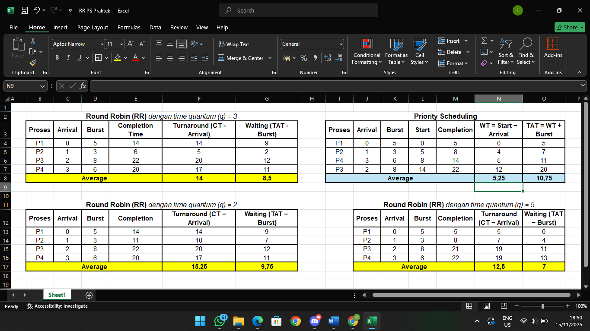

# Laporan Praktikum Minggu XI
Topik: Penjadwalan CPU – Round Robin (RR) dan Priority Scheduling


---

## Identitas
- **Nama**  : ERVITA DWI RIYANTI
- **NIM**   : 250202977
- **Kelas** : 1IKRA

---

## Tujuan
Tuliskan tujuan praktikum minggu ini.  
Contoh:  
Setelah menyelesaikan tugas ini, mahasiswa mampu:

1. Menghitung waiting time dan turnaround time pada algoritma RR dan Priority.
2. Menyusun tabel hasil perhitungan dengan benar dan sistematis.
3. Membandingkan performa algoritma RR dan Priority.
4. Menjelaskan pengaruh time quantum dan prioritas terhadap keadilan eksekusi proses.
5. Menarik kesimpulan mengenai efisiensi dan keadilan kedua algoritma.

---

## Dasar Teori

1. Penjadwalan CPU (CPU Scheduling)
Penjadwalan CPU adalah mekanisme sistem operasi untuk menentukan proses mana yang akan menjalankan CPU pada waktu tertentu. Tujuannya adalah memaksimalkan utilisasi CPU, mempercepat respons, meminimalkan waiting time, dan meningkatkan throughput.

2. Context Switching
Saat CPU berpindah dari satu proses ke proses lain, sistem melakukan context switch untuk menyimpan dan memulihkan state proses. Frekuensi context switch memengaruhi performa; semakin sering berpindah, semakin besar overhead yang ditimbulkan.

3. Round Robin (RR)
Round Robin merupakan algoritma penjadwalan preemptive yang memberikan jatah waktu sama bagi setiap proses (time quantum). Algoritma ini adil dan cocok untuk lingkungan time-sharing, tetapi performanya sangat dipengaruhi ukuran quantum.

4. Priority Scheduling
Algoritma ini menjalankan proses berdasarkan tingkat prioritas. Proses dengan prioritas lebih tinggi dieksekusi terlebih dahulu. Pendekatan ini dapat mempercepat penyelesaian proses penting, tetapi berpotensi menimbulkan starvation pada proses berprioritas rendah.

5. Waiting Time & Turnaround Time
Dua metrik utama dalam evaluasi algoritma penjadwalan:

Waiting Time (WT) adalah total waktu proses menunggu di ready queue sebelum mendapatkan CPU.
Turnaround Time (TAT) adalah total waktu dari proses tiba hingga selesai (Completion − Arrival).
Analisis kedua metrik ini membantu menilai efisiensi dan keadilan dari algoritma scheduling.
---

## Langkah Praktikum
1. **Siapkan Data Proses**
   Gunakan contoh data berikut (boleh dimodifikasi sesuai kebutuhan):
   | Proses | Burst Time | Arrival Time | Priority |
   |:--:|:--:|:--:|:--:|
   | P1 | 5 | 0 | 2 |
   | P2 | 3 | 1 | 1 |
   | P3 | 8 | 2 | 4 |
   | P4 | 6 | 3 | 3 |

2. **Eksperimen 1 – Round Robin (RR)**
   - Gunakan *time quantum (q)* = 3.  
   - Hitung *waiting time* dan *turnaround time* untuk tiap proses.  
   - Simulasikan eksekusi menggunakan Gantt Chart (manual atau spreadsheet).  
     ```
     | P1 | P2 | P3 | P4 | P1 | P3 | ...
     0    3    6    9   12   15   18  ...
     ```
   - Catat sisa *burst time* tiap putaran.

3. **Eksperimen 2 – Priority Scheduling (Non-Preemptive)**
   - Urutkan proses berdasarkan nilai prioritas (angka kecil = prioritas tinggi).  
   - Lakukan perhitungan manual untuk:
     ```
     WT[i] = waktu mulai eksekusi - Arrival[i]
     TAT[i] = WT[i] + Burst[i]
     ```
   - Buat tabel perbandingan hasil RR dan Priority.

4. **Eksperimen 3 – Analisis Variasi Time Quantum (Opsional)**
   - Ubah *quantum* menjadi 2 dan 5.  
   - Amati perubahan nilai rata-rata *waiting time* dan *turnaround time*.  
   - Buat tabel perbandingan efek *quantum*.

5. **Eksperimen 4 – Dokumentasi**
   - Simpan semua hasil tabel dan screenshot ke:
     ```
     praktikum/week6-scheduling-rr-priority/screenshots/
     ```
   - Buat tabel perbandingan seperti berikut:

     | Algoritma | Avg Waiting Time | Avg Turnaround Time | Kelebihan | Kekurangan |
     |------------|------------------|----------------------|------------|-------------|
     | RR | ... | ... | Adil terhadap semua proses | Tidak efisien jika quantum tidak tepat |
     | Priority | ... | ... | Efisien untuk proses penting | Potensi *starvation* pada prioritas rendah |

6. **Commit & Push**
   ```bash
   git add .
   git commit -m "Minggu 6 - CPU Scheduling RR & Priority"
   git push origin main
   ```

---

---

## Hasil Eksekusi
Sertakan screenshot hasil percobaan atau diagram:


## Eksperimen 1

**Round Robin(RR)** _time quantum (q) = 3_

| Proses | Arrival | Burst | Completion Time | Turnaround (CT - Arrival) | Waiting (TAT - Burst) |
| -----: | ------: | ----: | --------------: | ------------------------: | --------------------: |
|     P1 |       0 |     5 |              14 |                        14 |                     9 |
|     P2 |       1 |     3 |               6 |                         5 |                     2 |
|     P3 |       2 |     8 |              22 |                        20 |                    12 |
|     P4 |       3 |     6 |              20 |                        17 |                    11 |
|        |         |       | Average         | 14                        |         8,5           |

**Simulasikan eksekusi menggunakan Gantt Chart**

```
| P1 | P2 | P3 | P4 | P1 | P3 | P4 | P3 |
0    3    6    9   12   14   17   20   22
```

**Sisa burst time tiap putaran.**

| No | Proses | Start | End | Exec (ms) |    Remaining sebelum   |    Remaining sesudah   |
| -: | :----: | ----: | --: | --------: | :--------------------: | :--------------------: |
|  1 |   P1   |     0 |   3 |         3 | P1:5, P2:3, P3:8, P4:6 | P1:2, P2:3, P3:8, P4:6 |
|  2 |   P2   |     3 |   6 |         3 | P1:2, P2:3, P3:8, P4:6 | P1:2, P2:0, P3:8, P4:6 |
|  3 |   P3   |     6 |   9 |         3 | P1:2, P2:0, P3:8, P4:6 | P1:2, P2:0, P3:5, P4:6 |
|  4 |   P4   |     9 |  12 |         3 | P1:2, P2:0, P3:5, P4:6 | P1:2, P2:0, P3:5, P4:3 |
|  5 |   P1   |    12 |  14 |         2 | P1:2, P2:0, P3:5, P4:3 | P1:0, P2:0, P3:5, P4:3 |
|  6 |   P3   |    14 |  17 |         3 | P1:0, P2:0, P3:5, P4:3 | P1:0, P2:0, P3:2, P4:3 |
|  7 |   P4   |    17 |  20 |         3 | P1:0, P2:0, P3:2, P4:3 | P1:0, P2:0, P3:2, P4:0 |
|  8 |   P3   |    20 |  22 |         2 | P1:0, P2:0, P3:2, P4:0 | P1:0, P2:0, P3:0, P4:0 |


## Eksperimen 2

**Priority Scheduling (Non-Preemptive)**

| Proses | Arrival | Burst | Start | Completion | WT = Start − Arrival | TAT = WT + Burst |
| -----: | ------: | ----: | ----: | ---------: | -------------------: | ---------------: |
|     P1 |       0 |     5 |     0 |          5 |                    0 |                5 |
|     P2 |       1 |     3 |     5 |          8 |                    4 |                7 |
|     P4 |       3 |     6 |     8 |         14 |                    5 |               11 |
|     P3 |       2 |     8 |    14 |         22 |                   12 |               20 |
|        |         |       |       | Average    | 5,24                 |         10,75    |

**Tabel Perbandingan RR dan Priority Scheduling**

| Proses | RR WT | RR TAT | RR Completion | Priority WT | Priority TAT | Priority Completion |
| -----: | ----: | -----: | ------------: | ----------: | -----------: | ------------------: |
|     P1 |     9 |     14 |            14 |           0 |            5 |                   5 |
|     P2 |     2 |      5 |             6 |           4 |            7 |                   8 |
|     P3 |    12 |     20 |            22 |          12 |           20 |                  22 |
|     P4 |    11 |     17 |            20 |           5 |           11 |                  14 |

## Eksperimen 3

**Analisis Variasi Time Quantum (Opsional)**

**Round Robin(RR)** _time quantum (q) = 2_

| Proses | Arrival | Burst | Completion | Turnaround (CT − Arrival) | Waiting (TAT − Burst) |
| -----: | ------: | ----: | ---------: | ------------------------: | --------------------: |
|     P1 |       0 |     5 |         14 |                        14 |                     9 |
|     P2 |       1 |     3 |         11 |                        10 |                     7 |
|     P3 |       2 |     8 |         22 |                        20 |                    12 |
|     P4 |       3 |     6 |         20 |                        17 |                    11 |
|        |         |       | Average    | 15,25                     |         9,75          |


**Round Robin(RR)** _time quantum (q) = 5_

| Proses | Arrival | Burst | Completion | Turnaround (CT − Arrival) | Waiting (TAT − Burst)|
| -----: | ------: | ----: | ---------: | ---------:                | ------:              |
|     P1 |       0 |     5 |          5 |          5                |       0              |
|     P2 |       1 |     3 |          8 |          7                |       4              |
|     P3 |       2 |     8 |         21 |         19                |      11              |
|     P4 |       3 |     6 |         22 |         19                |      13              |
|        |         |       | Average    | 15,25                     |         9,75         |

**Tabel perbandingan efek quantum**

| Quantum | Avg Waiting Time | Avg Turnaround Time | Jumlah Slices (dispatches) | Context switches | CPU busy time | Total makespan |
| ------- | ---------------- | ------------------- |--------                    |-----             |-----          |-----           |
| **2**   | **10.75**        | **16.25**           | 12                         | 11               |22 / 22 (100%) |             22 |
| **3**   | **8.50**         | **14.00**           |8                           |                7 | 22 / 22 (100%)| 22             |
| **5**   | **7.00**         | **12.50**           |6                           | 5                | 22 / 22 (100%)| 22             |

Saya hitung context switches sebagai jumlah pergantian eksekusi antar-slice (jumlah potongan/dispatches − 1). Ini mengasumsikan tidak ada idle atau overhead yang tersendiri. Jika sistem menambahkan overhead per switch (mis. 0.5 ms/switch), waktu efektif dan utilisasi akan berubah — saya bisa hitung ulang jika Anda ingin memasukkan overhead.
Karakteristik umum tiap quantum (ringkasan perilaku):

- q = 2 (kecil) Banyak preemption / sering potong → fairness responsif (job panjang tidak dominan terus-menerus) tetapi banyak context switches. Hasil pada dataset ini: Avg WT = 10.75, Avg TAT = 16.25 (paling buruk di antara tiga q yang diuji).
Cocok untuk sistem interaktif yang butuh latency rendah per job kecil, namun mahal bila switching cost tinggi.

- q = 3 (menengah) Trade-off antara responsivitas dan overhead. Di contoh ini menghasilkan Avg WT = 8.50, Avg TAT = 14.00. Masih ada beberapa putaran bagi tiap proses, tapi jumlah switching lebih kecil dibanding q=2.

- q = 5 (besar / mendekati FCFS untuk pekerjaan yang datang lebih awal) Sedikit switching, proses awal (P1) selesai langsung → menurunkan waiting & turnaround rata-rata pada dataset ini (Avg WT = 7.00, Avg TAT = 12.50). Perilaku mendekati FCFS: bagus jika throughput/turnaround prioritas dan switching overhead besar; buruk jika sistem butuh jaminan respons untuk job interaktif tiba belakangan.

## Eksperimen 4
 | Algoritma | Avg Waiting Time | Avg Turnaround Time | Kelebihan                     | Kekurangan                             |
 |-----------|------------------|---------------------|-----------                    |-------------                           |
 | RR        | 8,5              | 14                  | Adil terhadap semua proses    | Tidak efisien jika quantum tidak tepat |
 | Priority  | 5,25             | 10,75               | Efisien untuk proses penting  | Potensi *starvation* pada prioritas rendah |

---

---

## Kesimpulan
Tuliskan 2–3 poin kesimpulan dari praktikum ini.

---

## D. Tugas & Quiz
### Tugas
1. Hitung *waiting time* dan *turnaround time* untuk algoritma RR dan Priority.  

   **Round Robin(RR)** _time quantum (q) = 3_

| Proses | Arrival | Burst | Completion Time | Turnaround (CT - Arrival) | Waiting (TAT - Burst) |
| -----: | ------: | ----: | --------------: | ------------------------: | --------------------: |
|     P1 |       0 |     5 |              14 |                        14 |                     9 |
|     P2 |       1 |     3 |               6 |                         5 |                     2 |
|     P3 |       2 |     8 |              22 |                        20 |                    12 |
|     P4 |       3 |     6 |              20 |                        17 |                    11 |
|        |         |       | Average         | 14                        |         8,5           |

**Priority Scheduling (Non-Preemptive)**

| Proses | Arrival | Burst | Start | Completion | WT = Start − Arrival | TAT = WT + Burst |
| -----: | ------: | ----: | ----: | ---------: | -------------------: | ---------------: |
|     P1 |       0 |     5 |     0 |          5 |                    0 |                5 |
|     P2 |       1 |     3 |     5 |          8 |                    4 |                7 |
|     P4 |       3 |     6 |     8 |         14 |                    5 |               11 |
|     P3 |       2 |     8 |    14 |         22 |                   12 |               20 |
|        |         |       |       | Average    | 5,24                 |         10,75    |


**Round Robin(RR)** _time quantum (q) = 2_

| Proses | Arrival | Burst | Completion | Turnaround (CT − Arrival) | Waiting (TAT − Burst) |
| -----: | ------: | ----: | ---------: | ------------------------: | --------------------: |
|     P1 |       0 |     5 |         14 |                        14 |                     9 |
|     P2 |       1 |     3 |         11 |                        10 |                     7 |
|     P3 |       2 |     8 |         22 |                        20 |                    12 |
|     P4 |       3 |     6 |         20 |                        17 |                    11 |
|        |         |       | Average    | 15,25                     |         9,75          |


**Round Robin(RR)** _time quantum (q) = 5_

| Proses | Arrival | Burst | Completion | Turnaround (CT − Arrival) | Waiting (TAT − Burst)|
| -----: | ------: | ----: | ---------: | ---------:                | ------:              |
|     P1 |       0 |     5 |          5 |          5                |       0              |
|     P2 |       1 |     3 |          8 |          7                |       4              |
|     P3 |       2 |     8 |         21 |         19                |      11              |
|     P4 |       3 |     6 |         22 |         19                |      13              |
|        |         |       | Average    | 15,25                     |         9,75         |


2. Sajikan hasil perhitungan dan Gantt Chart dalam `laporan.md`.  

RR _quantum 3_

```
| P1 | P2 | P3 | P4 | P1 | P3 | P4 | P3 |
0    3    6    9   12   14   17   20   22
```

RR _quantum 2_
```
| P1 | P2 | P3 | P1 | P4 | P2 | P3 | P1 | P4 | P3 | P4 | P3 |
0    2    4    6    8   10   11   13   14   16   18   20   22
```

RR _quantum 5_
```
| P1 | P2 | P3   | P4   | P3  | P4 |
0    5    8    13   18   21   22
```

_Priority Scheduling (Non-Preemptive)_
```
|  P1  |  P2  |   P4   |    P3    |
0      5      8        14        22
```
3. Bandingkan performa dan jelaskan pengaruh *time quantum* serta prioritas.
   
**Tabel Performa**

| Algoritma (konfigurasi)   | Avg Waiting Time | Avg Turnaround Time | Jumlah Slices (dispatches) | Context switches* | Makespan | Throughput (job/ms) | CPU busy time |
| ------------------------- | ---------------: | ------------------: | -------------------------: | ----------------: | -------: | ------------------: | ------------: |
| RR (q = 2)                |             9.75 |               15.25 |                         12 |                11 |       22 |     4 / 22 ≈ 0.1818 |     22 (100%) |
| RR (q = 3)                |             8.50 |               14.00 |                          8 |                 7 |       22 |              0.1818 |     22 (100%) |
| RR (q = 5)                |             7.00 |               12.50 |                          6 |                 5 |       22 |              0.1818 |     22 (100%) |
| Priority (non-preemptive) |             5.25 |               10.75 |                          4 |                 3 |       22 |              0.1818 |     22 (100%) |

**Tabel Pengaruh**

| Algoritma                 |                          Responsiveness |                             Fairness |      Overhead switching |                     Risiko starvation | Kapan direkomendasikan                                            |
| ------------------------- | --------------------------------------: | -----------------------------------: | ----------------------: | ------------------------------------: | ----------------------------------------------------------------- |
| RR (q small, e.g. 2)      | Tinggi (responsif ke proses interaktif) |       Tinggi (setiap job bergantian) |  Tinggi (banyak switch) |                                Rendah | Sistem interaktif dengan job pendek & switching murah             |
| RR (q medium, e.g. 3)     |                                Seimbang |                                 Baik |                  Sedang |                                Rendah | General-purpose time-sharing, trade-off responsivitas/overhead    |
| RR (q large, e.g. 5)      |         Lebih rendah (lebih mirip FCFS) |     Kurang (proses awal diuntungkan) |                  Rendah |                         Rendah–sedang | Kalau switching mahal atau ingin throughput/turnaround lebih baik |
| Priority (non-preemptive) | Rendah untuk job yang datang belakangan | Rendah (prioritas menentukan urutan) | Rendah (sedikit switch) | Ada kemungkinan (terutama preemptive) | Jika beberapa job jelas lebih penting (SLA/real-time soft)        |

Penjelasan 
a. Pengaruh Time Quantum (pada RR)

- Semakin kecil quantum → pros: lebih responsif terhadap job interaktif / setiap proses mendapat CPU cepat; kontra: lebih banyak context switches → overhead nyata bertambah → avg waiting & turnaround bisa meningkat jika overhead bukan nol. Dalam simulasi: q=2 menghasilkan Avg WT terbesar (9.75) karena banyak switching.

- Semakin besar quantum → pros: lebih sedikit switching (overhead turun), perilaku mendekati FCFS sehingga turnaround/ waiting umumnya turun pada dataset ini (q=5 terbaik: Avg WT = 7.00, Avg TAT = 12.50). kontra: responsivitas menurun untuk job yang tiba belakangan.

- Praktis: pilih q sedikit lebih besar dari ukuran job interaktif tipikal — kompromi antara respons dan overhead.

b. Pengaruh Prioritas (non-preemptive)

- Prioritas menempatkan job penting lebih awal, sehingga avg waiting & turnaround untuk keseluruhan dapat turun bila job prioritas tinggi juga relatif pendek atau arrival pattern mendukung. Pada contoh ini Priority (non-preemptive) menghasilkan Avg WT = 5.25 dan Avg TAT = 10.75, terbaik di antara semua konfigurasi.

- Risiko: tanpa mekanisme pencegah (mis. aging), job prioritas rendah bisa mengalami penundaan panjang (starvation) — terutama pada sistem prioritas preemptive. Karena ini non-preemptive dan arrival terbatas, starvation tidak terjadi pada contoh ini.

c. Overhead context switch

Jika sistem nyata punya biaya per switch (mis. 0.5 ms atau lebih), efeknya sangat terasa pada quantum kecil: makespan dan utilisasi akan menurun lebih untuk q kecil daripada q besar. Oleh karena itu perbandingan ideal (tanpa overhead) seperti tabel di atas bisa berubah kalau overhead dimasukkan.

d. Makespan & Throughput

Dalam simulasi (tanpa overhead), makespan sama (22) untuk semua konfigurasi dan throughput identik (4 job / 22 ms). Perbedaan muncul di waktu tunggu per-job (WT) dan TAT.

4. Simpan semua bukti (tabel, grafik, atau gambar) ke folder `screenshots/`.  

### Quiz
Tuliskan jawaban di bagian **Quiz** pada laporan:

1. Apa perbedaan utama antara Round Robin dan Priority Scheduling?  
Perbedaan utamanya adalah pada mekanisme pemilihan proses:

- Round Robin (RR) memilih proses berdasarkan urutan antrian dengan jatah waktu (time quantum) yang sama untuk semua proses. RR menekankan keadilan dan responsivitas, terutama untuk sistem interaktif.

- Priority Scheduling memilih proses berdasarkan tingkat prioritas; proses dengan prioritas lebih tinggi dijalankan lebih dulu. Ini menekankan kepentingan/urgensi suatu proses, bukan keadilan.

2. Apa pengaruh besar/kecilnya *time quantum* terhadap performa sistem?
   
a. Quantum kecil, proses sering berpindah (banyak context switch).

- Kelebihan: sistem sangat responsif, terutama untuk proses pendek/IO-bound.

- Kekurangan: overhead besar, waiting time dan turnaround time cenderung lebih tinggi jika overhead dihitung.

b. Quantum besar, mirip FCFS.

- Kelebihan: context switch sedikit, waiting time dan turnaround time rata-rata bisa lebih rendah.

- Kekurangan: responsivitas menurun; proses pendek bisa menunggu lama.
  
3. Mengapa algoritma Priority dapat menyebabkan *starvation*?
  
starvation terjadi karena proses berprioritas rendah berkali-kali dilewati oleh proses prioritas lebih tinggi. Jika proses prioritas tinggi terus datang atau jumlahnya banyak, maka proses prioritas rendah tidak pernah mendapatkan CPU, atau menunggu sangat lama. Algoritma ini tidak memiliki mekanisme otomatis untuk menaikkan prioritas proses yang terlalu lama menunggu (kecuali ditambahkan teknik seperti aging).

---

## Refleksi Diri
Tuliskan secara singkat:
- Apa bagian yang paling menantang minggu ini?
- Bagaimana cara Anda mengatasinya?  

---

**Credit:**  
_Template laporan praktikum Sistem Operasi (SO-202501) – Universitas Putra Bangsa_
